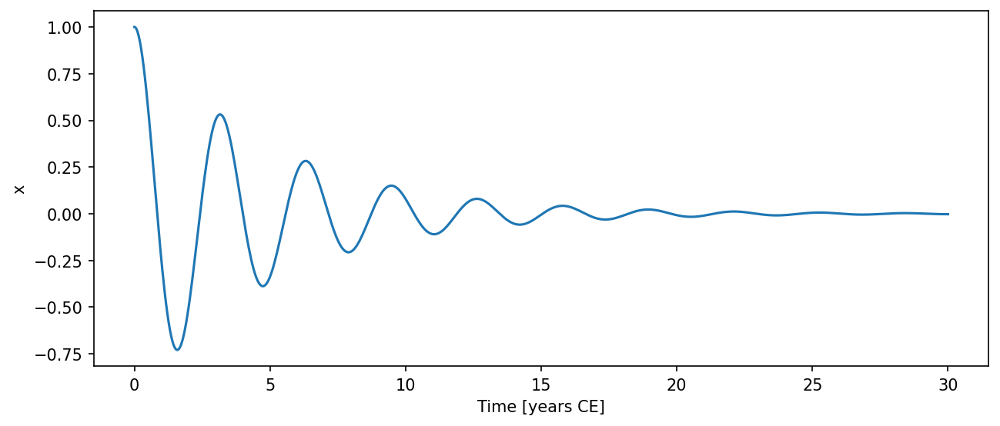
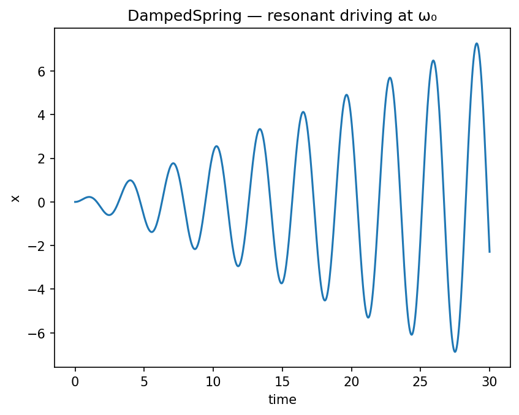

# DampedSpring { #climatecritters.DampedSpring }

```python
DampedSpring(
    var_name='damped_spring',
    m=1.0,
    k=1.0,
    c=0.1,
    F=0.0,
    state_variables=None,
    diagnostic_variables=None,
    *args,
    **kwargs,
)
```

Damped (and optionally driven) spring-mass oscillator.

## Parameters {.doc-section .doc-section-parameters}

<code>[**var_name**]{.parameter-name} [:]{.parameter-annotation-sep} []{.parameter-annotation} [ = ]{.parameter-default-sep} [\'damped_spring\']{.parameter-default}</code>

:   Human-readable label for the model.

<code>[**m**]{.parameter-name} [:]{.parameter-annotation-sep} []{.parameter-annotation} [ = ]{.parameter-default-sep} [1.0]{.parameter-default}</code>

:   Mass in kg.  Must be > 0.

<code>[**k**]{.parameter-name} [:]{.parameter-annotation-sep} []{.parameter-annotation} [ = ]{.parameter-default-sep} [1.0]{.parameter-default}</code>

:   Spring constant in N/m.  Must be > 0.

<code>[**c**]{.parameter-name} [:]{.parameter-annotation-sep} []{.parameter-annotation} [ = ]{.parameter-default-sep} [0.1]{.parameter-default}</code>

:   Linear damping coefficient in N·s/m.  ``c=0`` gives undamped SHM; ``c < 2*sqrt(k*m)`` gives underdamped (oscillatory) decay.

<code>[**F**]{.parameter-name} [:]{.parameter-annotation-sep} [[float](`float`) or [callable](`callable`) or [cc](`cc`).[Forcing](`cc.Forcing`)]{.parameter-annotation} [ = ]{.parameter-default-sep} [0.0]{.parameter-default}</code>

:   External driving force (N).  Default 0.0 (undriven).  For a time-varying drive use ``model.register_forcing('F', forcing_obj)``.

<code>[**state_variables**]{.parameter-name} [:]{.parameter-annotation-sep} []{.parameter-annotation} [ = ]{.parameter-default-sep} [None]{.parameter-default}</code>

:   Names for the two integrated state variables (position, velocity).

<code>[**diagnostic_variables**]{.parameter-name} [:]{.parameter-annotation-sep} []{.parameter-annotation} [ = ]{.parameter-default-sep} [None]{.parameter-default}</code>

:   Names for post-integration diagnostics.

## Notes {.doc-section .doc-section-notes}

State variables are ``x`` (position) and ``v`` (velocity) in that order.
Diagnostic variables ``energy`` and ``omega_0`` are computed after
integration.

## Examples {.doc-section .doc-section-examples}

```python
import numpy as np
import matplotlib.pyplot as plt
import climatecritters as cc
from climatecritters.model_critters.damped_spring import DampedSpring

model = DampedSpring(m=1.0, k=4.0, c=0.4)
output = model.integrate(t_span=(0, 30), y0=[1.0, 0.0], method='RK45')
ts = output.to_pyleo(var_names=['x'])
ts.plot()
plt.savefig('docs/reference/figures/DampedSpring_example.png',
            dpi=150, bbox_inches='tight')
```




With resonant driving (external force at ω₀):

```python
import numpy as np
import matplotlib.pyplot as plt
import climatecritters as cc
from climatecritters.model_critters.damped_spring import DampedSpring

m, k = 1.0, 4.0
omega_0 = np.sqrt(k / m)
model = DampedSpring(m=m, k=k, c=0.0)
model.register_forcing('F', cc.Forcing(lambda t: np.cos(omega_0 * t)))
output = model.integrate(t_span=(0, 30), y0=[0.0, 0.0], method='RK45')
fig, ax = plt.subplots()
ax.plot(output.time, output.state_variables['x'])
ax.set_xlabel('time'); ax.set_ylabel('x')
ax.set_title('DampedSpring — resonant driving at ω₀')
plt.savefig('docs/reference/figures/DampedSpring_resonance_example.png',
            dpi=150, bbox_inches='tight')
```




## Methods

| Name | Description |
| --- | --- |
| [damping_ratio](#climatecritters.DampedSpring.damping_ratio) | Return ζ = c / (2√(km)).  ζ<1 underdamped, ζ=1 critical, ζ>1 overdamped. |
| [natural_frequency](#climatecritters.DampedSpring.natural_frequency) | Return ω₀ = √(k/m) in rad/s (uses current param_values). |
| [natural_period](#climatecritters.DampedSpring.natural_period) | Return T₀ = 2π/ω₀ in seconds (uses current param_values). |

### damping_ratio { #climatecritters.DampedSpring.damping_ratio }

```python
DampedSpring.damping_ratio()
```

Return ζ = c / (2√(km)).  ζ<1 underdamped, ζ=1 critical, ζ>1 overdamped.

### natural_frequency { #climatecritters.DampedSpring.natural_frequency }

```python
DampedSpring.natural_frequency()
```

Return ω₀ = √(k/m) in rad/s (uses current param_values).

### natural_period { #climatecritters.DampedSpring.natural_period }

```python
DampedSpring.natural_period()
```

Return T₀ = 2π/ω₀ in seconds (uses current param_values).