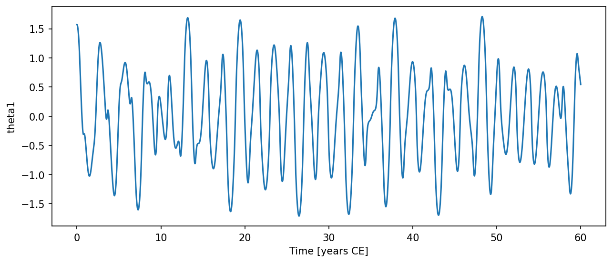

# DoublePendulum { #climatecritters.DoublePendulum }

```python
DoublePendulum(
    var_name='double_pendulum',
    m1=1.0,
    m2=1.0,
    L1=1.0,
    L2=1.0,
    g=9.81,
    d1=0.0,
    d2=0.0,
    state_variables=None,
    diagnostic_variables=None,
    *args,
    **kwargs,
)
```

Double pendulum — a conservative chaotic system.

Two point masses connected by rigid, massless rods swing freely from a
pivot.  The system is Hamiltonian (no damping by default) and is chaotic
for most non-trivial initial conditions.

State variables: [θ₁, ω₁, θ₂, ω₂]

## Parameters {.doc-section .doc-section-parameters}

<code>[**var_name**]{.parameter-name} [:]{.parameter-annotation-sep} []{.parameter-annotation} [ = ]{.parameter-default-sep} [\'double_pendulum\']{.parameter-default}</code>

:   Human-readable label.

<code>[**m1**]{.parameter-name} [:]{.parameter-annotation-sep} []{.parameter-annotation} [ = ]{.parameter-default-sep} [1.0]{.parameter-default}</code>

:   Masses of the two bobs in kg.

<code>[**m2**]{.parameter-name} [:]{.parameter-annotation-sep} []{.parameter-annotation} [ = ]{.parameter-default-sep} [1.0]{.parameter-default}</code>

:   Masses of the two bobs in kg.

<code>[**L1**]{.parameter-name} [:]{.parameter-annotation-sep} []{.parameter-annotation} [ = ]{.parameter-default-sep} [1.0]{.parameter-default}</code>

:   Rod lengths in metres.

<code>[**L2**]{.parameter-name} [:]{.parameter-annotation-sep} []{.parameter-annotation} [ = ]{.parameter-default-sep} [1.0]{.parameter-default}</code>

:   Rod lengths in metres.

<code>[**g**]{.parameter-name} [:]{.parameter-annotation-sep} []{.parameter-annotation} [ = ]{.parameter-default-sep} [9.81]{.parameter-default}</code>

:   Gravitational acceleration in m/s².

<code>[**d1**]{.parameter-name} [:]{.parameter-annotation-sep} []{.parameter-annotation} [ = ]{.parameter-default-sep} [0.0]{.parameter-default}</code>

:   Optional linear damping coefficients on ω₁ and ω₂ (s⁻¹). Default 0 (Hamiltonian / energy-conserving).

<code>[**d2**]{.parameter-name} [:]{.parameter-annotation-sep} []{.parameter-annotation} [ = ]{.parameter-default-sep} [0.0]{.parameter-default}</code>

:   Optional linear damping coefficients on ω₁ and ω₂ (s⁻¹). Default 0 (Hamiltonian / energy-conserving).

## Notes {.doc-section .doc-section-notes}

State variables are ``theta1``, ``omega1``, ``theta2``, ``omega2`` in
that order.  Diagnostic variables ``energy``, ``x1``, ``y1``, ``x2``,
``y2`` are computed after integration.

The double pendulum is chaotic.  RK45 with default tolerances can show
significant energy drift for long or large-amplitude runs.  Use tight
tolerances for accurate energy tracking::

    model.integrate(..., kwargs={'rtol': 1e-10, 'atol': 1e-12})

## Examples {.doc-section .doc-section-examples}

```python
import matplotlib.pyplot as plt
import numpy as np
from climatecritters.model_critters.pendulum import DoublePendulum

model = DoublePendulum(m1=1.0, m2=1.0, L1=1.0, L2=1.0)
output = model.integrate(
    t_span=(0, 60), y0=[np.pi/2, 0.0, np.pi/4, 0.0], method='RK45',
    kwargs={'rtol': 1e-10, 'atol': 1e-12},
)
ts = output.to_pyleo(var_names=['theta1'])
ts.plot()
plt.savefig('docs/reference/figures/DoublePendulum_example.png',
            dpi=150, bbox_inches='tight')
```




## Methods

| Name | Description |
| --- | --- |
| [cartesian_positions](#climatecritters.DoublePendulum.cartesian_positions) | Return (x1, y1, x2, y2) from the last integration run. |

### cartesian_positions { #climatecritters.DoublePendulum.cartesian_positions }

```python
DoublePendulum.cartesian_positions()
```

Return (x1, y1, x2, y2) from the last integration run.