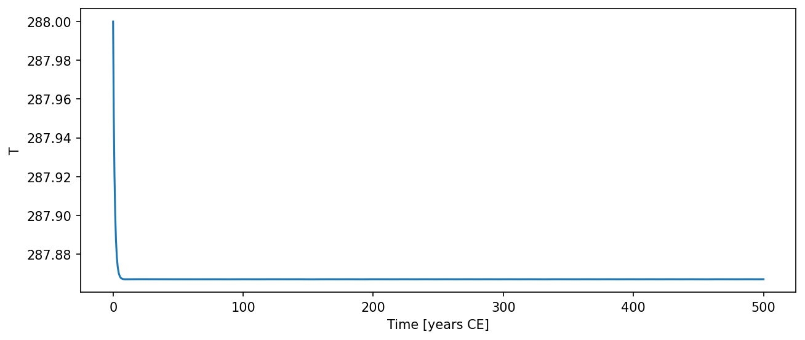

# EBM0D { #climatecritters.EBM0D }

```python
EBM0D(
    var_name='temperature',
    state_variables=None,
    diagnostic_variables=None,
    OLR=None,
    C=4,
    albedo=0.3,
    S0=1365.0,
)
```

Zero-dimensional energy balance model for global-mean surface temperature.

Evolves global-mean surface temperature T according to:

    C dT/dt = (1 - alpha) * S0/4 - OLR

where ``S0`` is the solar constant, ``alpha`` is the planetary albedo,
and OLR is the outgoing longwave radiation.

## Parameters {.doc-section .doc-section-parameters}

<code>[**state_variables**]{.parameter-name} [:]{.parameter-annotation-sep} [list of str]{.parameter-annotation} [ = ]{.parameter-default-sep} [None]{.parameter-default}</code>

:   Names of the integrated state variables.  Default is ``['T']``.

<code>[**diagnostic_variables**]{.parameter-name} [:]{.parameter-annotation-sep} [list of str]{.parameter-annotation} [ = ]{.parameter-default-sep} [None]{.parameter-default}</code>

:   Names of diagnostic quantities accumulated during integration. Default is ``['albedo', 'absorbed_SW', 'OLR', 'solar_incoming']``.

<code>[**var_name**]{.parameter-name} [:]{.parameter-annotation-sep} [[str](`str`)]{.parameter-annotation} [ = ]{.parameter-default-sep} [\'temperature\']{.parameter-default}</code>

:   Label for the modeled quantity.  Default is ``'temperature'``.

<code>[**OLR**]{.parameter-name} [:]{.parameter-annotation-sep} [[callable](`callable`) or None]{.parameter-annotation} [ = ]{.parameter-default-sep} [None]{.parameter-default}</code>

:   Outgoing longwave radiation.  Must have a compliant signature: ``(t)``, ``(t, state)``, or ``(t, state, model)`` with the first argument named ``t`` or ``time`` (see ``contracts/signal_model_contract.md``).  Default is Stefan-Boltzmann via ``OLR_func(pRad=650, ps=1000)``.

<code>[**C**]{.parameter-name} [:]{.parameter-annotation-sep} [[float](`float`) or [callable](`callable`) or [cc](`cc`).[Forcing](`cc.Forcing`)]{.parameter-annotation} [ = ]{.parameter-default-sep} [4]{.parameter-default}</code>

:   Heat capacity (W yr m⁻² K⁻¹).  If callable, must follow the parameter callable contract.  Default is 4.

<code>[**albedo**]{.parameter-name} [:]{.parameter-annotation-sep} [[float](`float`) or [callable](`callable`) or [cc](`cc`).[Forcing](`cc.Forcing`)]{.parameter-annotation} [ = ]{.parameter-default-sep} [0.3]{.parameter-default}</code>

:   Planetary albedo.  If callable, must follow the parameter callable contract.  Default is 0.3.

<code>[**S0**]{.parameter-name} [:]{.parameter-annotation-sep} [[float](`float`) or [callable](`callable`) or [cc](`cc`).[Forcing](`cc.Forcing`)]{.parameter-annotation} [ = ]{.parameter-default-sep} [1365.0]{.parameter-default}</code>

:   Solar constant (W m⁻²).  Default 1365.0.  Pass a time-varying orbital signal via ``model.register_forcing('S0', forcing_obj)``.

## Notes {.doc-section .doc-section-notes}

State variable is ``T`` (global-mean surface temperature, K).  Diagnostic
variables ``albedo``, ``absorbed_SW``, ``OLR``, and ``solar_incoming``
are accumulated step-by-step during integration.

All parameters support time-varying callables or Forcing objects;
they are resolved at each timestep via ``get_param_value``.

## See also {.doc-section .doc-section-see-also}

EBM1DLat : Latitudinally-resolved 1D variant.
OLR_func : Default OLR callable factory.
albedo_func : Ice-albedo callable for use as the ``albedo`` parameter.

## Examples {.doc-section .doc-section-examples}

```python
import matplotlib.pyplot as plt
import climatecritters as cc
from climatecritters.model_critters.ebm import EBM0D

model = EBM0D(S0=1360.0)
output = model.integrate(t_span=(0, 500), y0=[288.0], method='RK45')
ts = output.to_pyleo(var_names=['T'])
ts.plot()
plt.savefig('docs/reference/figures/EBM0D_example.png',
            dpi=150, bbox_inches='tight')
```




With a time-varying albedo and custom OLR:

```python
from climatecritters.model_critters.ebm import EBM0D, albedo_func, OLR_func

model = EBM0D(albedo=albedo_func, OLR=OLR_func(pRad=600))
```

## Methods

| Name | Description |
| --- | --- |
| [dydt](#climatecritters.EBM0D.dydt) | Evaluate the right-hand side of the ODE at time t and state x. |

### dydt { #climatecritters.EBM0D.dydt }

```python
EBM0D.dydt(t, x)
```

Evaluate the right-hand side of the ODE at time t and state x.

Called by the solver at each timestep.  As a side effect, appends the
current state to ``self.state_variables`` and appends each diagnostic
quantity to the corresponding list in ``self.diagnostic_variables``.

#### Parameters {.doc-section .doc-section-parameters}

<code>[**t**]{.parameter-name} [:]{.parameter-annotation-sep} [[float](`float`)]{.parameter-annotation}</code>

:   Current time.

<code>[**x**]{.parameter-name} [:]{.parameter-annotation-sep} [[array](`array`) - [like](`like`)]{.parameter-annotation}</code>

:   Current state vector.  ``x[0]`` is the global-mean temperature T (K).

#### Returns {.doc-section .doc-section-returns}

<code>[**dydt**]{.parameter-name} [:]{.parameter-annotation-sep} [list of float]{.parameter-annotation}</code>

:   Time-derivatives ``[dT/dt]``.