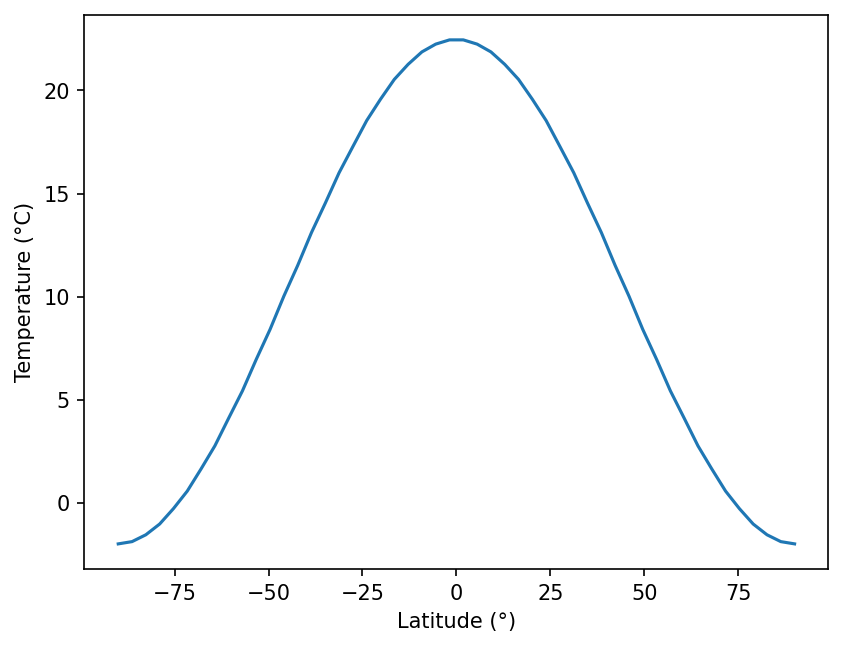
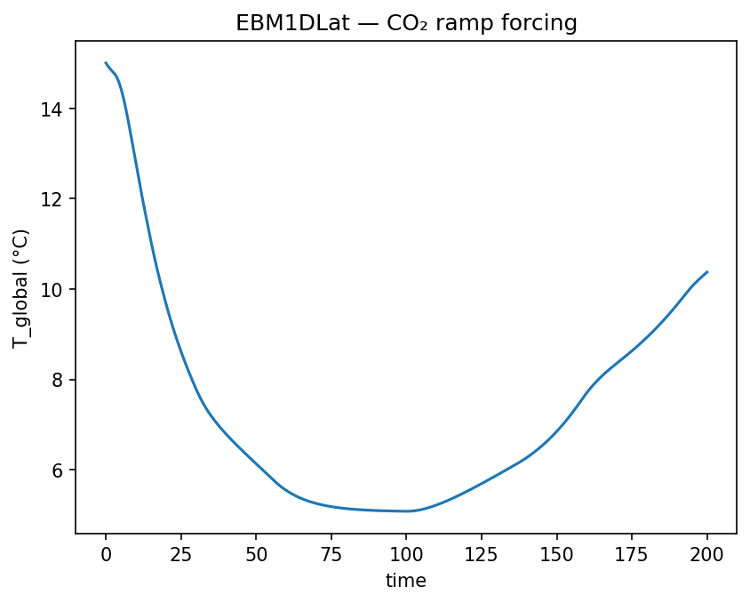

# EBM1DLat { #climatecritters.EBM1DLat }

```python
EBM1DLat(
    var_name='ebm1d_lat',
    grid_n=50,
    C=10.0,
    D=0.55,
    A=210.0,
    B=2.0,
    S0=1365.0,
    CO2_forcing=0.0,
    state_variables=None,
    diagnostic_variables=None,
)
```

Diffusive annual-mean latitudinal energy balance model (Budyko-Sellers type).

Evolves the zonal-mean temperature profile T(phi) on a latitude grid:

    C dT/dt = S(x)(1 - alpha(T)) - OLR(T) + D * div(grad T)

where ``x = sin(phi)``, OLR follows the Budyko linear form
``(A - CO2_forcing) + B * T``, and diffusion is computed in x-coordinates
with no-flux polar boundary conditions.

## Parameters {.doc-section .doc-section-parameters}

<code>[**var_name**]{.parameter-name} [:]{.parameter-annotation-sep} [[str](`str`)]{.parameter-annotation} [ = ]{.parameter-default-sep} [\'ebm1d_lat\']{.parameter-default}</code>

:   Label for the modeled quantity.  Default is ``'ebm1d_lat'``.

<code>[**grid_n**]{.parameter-name} [:]{.parameter-annotation-sep} [[int](`int`)]{.parameter-annotation} [ = ]{.parameter-default-sep} [50]{.parameter-default}</code>

:   Number of evenly-spaced latitude grid points from -90° to 90°. Must be ≥ 3.  Default is 50.

<code>[**C**]{.parameter-name} [:]{.parameter-annotation-sep} [[float](`float`) or [callable](`callable`) or [cc](`cc`).[Forcing](`cc.Forcing`)]{.parameter-annotation} [ = ]{.parameter-default-sep} [10.0]{.parameter-default}</code>

:   Heat capacity (W yr m⁻² K⁻¹).  Default is 10.0.

<code>[**D**]{.parameter-name} [:]{.parameter-annotation-sep} [[float](`float`) or [callable](`callable`) or [cc](`cc`).[Forcing](`cc.Forcing`)]{.parameter-annotation} [ = ]{.parameter-default-sep} [0.55]{.parameter-default}</code>

:   Meridional diffusion coefficient.  Default is 0.55.

<code>[**A**]{.parameter-name} [:]{.parameter-annotation-sep} [[float](`float`) or [callable](`callable`) or [cc](`cc`).[Forcing](`cc.Forcing`)]{.parameter-annotation} [ = ]{.parameter-default-sep} [210.0]{.parameter-default}</code>

:   Budyko OLR intercept (W m⁻²).  Default is 210.0.

<code>[**B**]{.parameter-name} [:]{.parameter-annotation-sep} [[float](`float`) or [callable](`callable`) or [cc](`cc`).[Forcing](`cc.Forcing`)]{.parameter-annotation} [ = ]{.parameter-default-sep} [2.0]{.parameter-default}</code>

:   Budyko OLR slope (W m⁻² K⁻¹).  Default is 2.0.

<code>[**S0**]{.parameter-name} [:]{.parameter-annotation-sep} [[float](`float`) or [callable](`callable`) or [cc](`cc`).[Forcing](`cc.Forcing`)]{.parameter-annotation} [ = ]{.parameter-default-sep} [1365.0]{.parameter-default}</code>

:   Solar constant (W m⁻²).  Default is 1365.0.

<code>[**CO2_forcing**]{.parameter-name} [:]{.parameter-annotation-sep} [[float](`float`) or [callable](`callable`) or [cc](`cc`).[Forcing](`cc.Forcing`)]{.parameter-annotation} [ = ]{.parameter-default-sep} [0.0]{.parameter-default}</code>

:   Radiative forcing from CO2 (W m⁻²); shifts the OLR intercept down, warming the climate.  Default is 0.0.

<code>[**state_variables**]{.parameter-name} [:]{.parameter-annotation-sep} [list of str]{.parameter-annotation} [ = ]{.parameter-default-sep} [None]{.parameter-default}</code>

:   Names of the integrated state variables.  Defaults to ``['T_0', 'T_1', ..., 'T_{grid_n-1}']``.

<code>[**diagnostic_variables**]{.parameter-name} [:]{.parameter-annotation-sep} [list of str]{.parameter-annotation} [ = ]{.parameter-default-sep} [None]{.parameter-default}</code>

:   Names of diagnostic quantities computed from the solved trajectory. Default is ``['ice_line_lat', 'Tglobal']``.

## Notes {.doc-section .doc-section-notes}

State variables are ``T_0`` through ``T_{grid_n-1}`` (one temperature per
latitude band, ordered from south pole to north pole).  Diagnostic
variables ``ice_line_lat`` and ``Tglobal`` are derived after integration.

``validate_initial_state`` accepts a scalar and broadcasts it uniformly
to the full grid.

All parameters (``C``, ``D``, ``A``, ``B``, ``S0``, ``CO2_forcing``) are
registered in ``param_values`` and can be swapped for callables or
Forcing objects.  Callables must follow the contract ``(t)``,
``(t, state)``, or ``(t, state, model)``.

## See also {.doc-section .doc-section-see-also}

EBM0D : Zero-dimensional variant.
EBMBase : Shared base class.
albedo_func1D : Latitudinally-resolved albedo callable.

## Examples {.doc-section .doc-section-examples}

```python
import matplotlib.pyplot as plt
import numpy as np
from climatecritters.model_critters.ebm import EBM1DLat

grid_n = 50
model = EBM1DLat(S0=1365.0, grid_n=grid_n)
output = model.integrate(
    t_span=(0, 200), y0=np.full(grid_n, 15.0), method='RK45'
)
# Plot the equilibrium latitude–temperature profile
T_final = [output.state_variables[f'T_{i}'][-1] for i in range(grid_n)]
phi = np.linspace(-90, 90, grid_n)
fig, ax = plt.subplots()
ax.plot(phi, T_final)
ax.set_xlabel('Latitude (°)'); ax.set_ylabel('Temperature (°C)')
plt.savefig('docs/reference/figures/EBM1DLat_example.png',
            dpi=150, bbox_inches='tight')
```




With a CO2 ramp:

```python
import matplotlib.pyplot as plt
import climatecritters as cc
from climatecritters.model_critters.ebm import EBM1DLat

co2_ramp = cc.Forcing.from_sequence([
    cc.forcing.Hold(duration=100, value=0.0),
    cc.forcing.Ramp(duration=100, y0=0.0, yf=4.0, shape='linear'),
])
model_co2 = EBM1DLat(CO2_forcing=co2_ramp, D=0.35)
output_co2 = model_co2.integrate(t_span=(0, 200), y0=[15.0], method='RK45')
fig, ax = plt.subplots()
ax.plot(output_co2.time, output_co2.diagnostic_variables['Tglobal'])
ax.set_xlabel('time'); ax.set_ylabel('T_global (°C)')
ax.set_title('EBM1DLat — CO₂ ramp forcing')
plt.savefig('docs/reference/figures/EBM1DLat_co2_example.png',
            dpi=150, bbox_inches='tight')
```




## Methods

| Name | Description |
| --- | --- |
| [annual_mean_insolation](#climatecritters.EBM1DLat.annual_mean_insolation) | Compute annual-mean insolation with a P2 latitudinal distribution. |
| [calc_OLR](#climatecritters.EBM1DLat.calc_OLR) | Compute the Budyko linear OLR: ``(A - CO2_forcing) + B * T``. |
| [calc_albedo](#climatecritters.EBM1DLat.calc_albedo) | Compute the latitudinal ice-albedo with a linear transition zone. |
| [calc_diffusion](#climatecritters.EBM1DLat.calc_diffusion) | Compute meridional heat diffusion in x = sin(phi) coordinates. |
| [calc_global_mean](#climatecritters.EBM1DLat.calc_global_mean) | Compute the cosine-weighted global mean temperature. |
| [calc_ice_line_lat](#climatecritters.EBM1DLat.calc_ice_line_lat) | Interpolate the ice-line latitude from the temperature profile. |
| [dydt](#climatecritters.EBM1DLat.dydt) | Evaluate the right-hand side of the PDE at time t and state. |
| [populate_diagnostics_from_history](#climatecritters.EBM1DLat.populate_diagnostics_from_history) | Compute diagnostic variables from the full solved trajectory. |
| [validate_initial_state](#climatecritters.EBM1DLat.validate_initial_state) | Validate and normalize the initial temperature profile. |

### annual_mean_insolation { #climatecritters.EBM1DLat.annual_mean_insolation }

```python
EBM1DLat.annual_mean_insolation(t, state)
```

Compute annual-mean insolation with a P2 latitudinal distribution.

Approximates the zonal-mean annual-mean absorbed solar radiation as:

    S(x) = (S0 / 4) * s(x),    s(x) = 1 - 0.482 * P2(sin phi)

where P2 is the second Legendre polynomial and x = sin(phi).

#### Parameters {.doc-section .doc-section-parameters}

<code>[**t**]{.parameter-name} [:]{.parameter-annotation-sep} [[float](`float`)]{.parameter-annotation}</code>

:   Current time, passed to ``get_param_value`` for time-varying S0.

<code>[**state**]{.parameter-name} [:]{.parameter-annotation-sep} [[array](`array`) - [like](`like`)]{.parameter-annotation}</code>

:   Current state vector (used only to satisfy the callable contract when resolving ``S0``).

#### Returns {.doc-section .doc-section-returns}

<code>[**insolation**]{.parameter-name} [:]{.parameter-annotation-sep} [ndarray of float, shape (grid_n,)]{.parameter-annotation}</code>

:   Annual-mean insolation at each latitude grid point (W m⁻²).

### calc_OLR { #climatecritters.EBM1DLat.calc_OLR }

```python
EBM1DLat.calc_OLR(T, t)
```

Compute the Budyko linear OLR: ``(A - CO2_forcing) + B * T``.

Overrides :meth:`EBMBase.calc_OLR`.  Parameters ``A``, ``B``, and
``CO2_forcing`` are resolved through ``get_param_value``, so they can
be time-varying or Forcing objects.

#### Parameters {.doc-section .doc-section-parameters}

<code>[**T**]{.parameter-name} [:]{.parameter-annotation-sep} [([array](`array`) - [like](`like`), [shape](`shape`)([grid_n](`climatecritters.model_critters.ebm.EBM1DLat.grid_n`)))]{.parameter-annotation}</code>

:   Current temperature profile.

<code>[**t**]{.parameter-name} [:]{.parameter-annotation-sep} [[float](`float`)]{.parameter-annotation}</code>

:   Current time, passed to ``get_param_value`` for time-varying params.

#### Returns {.doc-section .doc-section-returns}

<code>[**olr**]{.parameter-name} [:]{.parameter-annotation-sep} [ndarray of float, shape (grid_n,)]{.parameter-annotation}</code>

:   Outgoing longwave radiation at each latitude grid point (W m⁻²).

### calc_albedo { #climatecritters.EBM1DLat.calc_albedo }

```python
EBM1DLat.calc_albedo(T, t)
```

Compute the latitudinal ice-albedo with a linear transition zone.

Overrides :meth:`EBMBase.calc_albedo`.  Each grid point is assigned
an albedo based on local temperature: 0.6 below -10 °C, 0.3 above
0 °C, and a linear blend in between.

#### Parameters {.doc-section .doc-section-parameters}

<code>[**T**]{.parameter-name} [:]{.parameter-annotation-sep} [([array](`array`) - [like](`like`), [shape](`shape`)([grid_n](`climatecritters.model_critters.ebm.EBM1DLat.grid_n`)))]{.parameter-annotation}</code>

:   Current temperature profile (°C or K — the threshold values -10 and 0 assume °C; ensure consistency with initial conditions).

<code>[**t**]{.parameter-name} [:]{.parameter-annotation-sep} [[float](`float`)]{.parameter-annotation}</code>

:   Current time.  Unused; kept for a uniform external signature.

#### Returns {.doc-section .doc-section-returns}

<code>[**albedo**]{.parameter-name} [:]{.parameter-annotation-sep} [ndarray of float, shape (grid_n,)]{.parameter-annotation}</code>

:   Albedo at each latitude grid point, in [0.3, 0.6].

### calc_diffusion { #climatecritters.EBM1DLat.calc_diffusion }

```python
EBM1DLat.calc_diffusion(temperature, t, state)
```

Compute meridional heat diffusion in x = sin(phi) coordinates.

Applies no-flux boundary conditions at the poles by setting the
diffusive flux to zero at the first and last grid points before
taking the divergence.

#### Parameters {.doc-section .doc-section-parameters}

<code>[**temperature**]{.parameter-name} [:]{.parameter-annotation-sep} [([array](`array`) - [like](`like`), [shape](`shape`)([grid_n](`climatecritters.model_critters.ebm.EBM1DLat.grid_n`)))]{.parameter-annotation}</code>

:   Current temperature profile.

<code>[**t**]{.parameter-name} [:]{.parameter-annotation-sep} [[float](`float`)]{.parameter-annotation}</code>

:   Current time, passed to ``get_param_value`` for time-varying D.

<code>[**state**]{.parameter-name} [:]{.parameter-annotation-sep} [[array](`array`) - [like](`like`)]{.parameter-annotation}</code>

:   Current full state vector (used only to satisfy the callable contract when resolving ``D``).

#### Returns {.doc-section .doc-section-returns}

<code>[**diffusion**]{.parameter-name} [:]{.parameter-annotation-sep} [ndarray of float, shape (grid_n,)]{.parameter-annotation}</code>

:   Diffusive heat flux convergence at each grid point (W m⁻²), scaled by the transport factor ``pi/2``.

### calc_global_mean { #climatecritters.EBM1DLat.calc_global_mean }

```python
EBM1DLat.calc_global_mean(temperature)
```

Compute the cosine-weighted global mean temperature.

#### Parameters {.doc-section .doc-section-parameters}

<code>[**temperature**]{.parameter-name} [:]{.parameter-annotation-sep} [([array](`array`) - [like](`like`), [shape](`shape`)([grid_n](`climatecritters.model_critters.ebm.EBM1DLat.grid_n`)))]{.parameter-annotation}</code>

:   Zonal-mean temperature profile at one timestep.

#### Returns {.doc-section .doc-section-returns}

<code>[**Tglobal**]{.parameter-name} [:]{.parameter-annotation-sep} [[float](`float`)]{.parameter-annotation}</code>

:   Area-weighted global mean temperature in the same units as input.

### calc_ice_line_lat { #climatecritters.EBM1DLat.calc_ice_line_lat }

```python
EBM1DLat.calc_ice_line_lat(temperature)
```

Interpolate the ice-line latitude from the temperature profile.

Defines the ice line as the -10 °C isotherm.  Computes the ice-line
latitude independently in each hemisphere using linear interpolation
between the two adjacent grid points that straddle the threshold, then
returns the average of the two hemispheric values.

Special cases: returns 90° if a hemisphere is entirely above the
threshold (no ice) and 0° if entirely at or below it (full ice cover).

#### Parameters {.doc-section .doc-section-parameters}

<code>[**temperature**]{.parameter-name} [:]{.parameter-annotation-sep} [([array](`array`) - [like](`like`), [shape](`shape`)([grid_n](`climatecritters.model_critters.ebm.EBM1DLat.grid_n`)))]{.parameter-annotation}</code>

:   Zonal-mean temperature profile at one timestep.

#### Returns {.doc-section .doc-section-returns}

<code>[**ice_line_lat**]{.parameter-name} [:]{.parameter-annotation-sep} [[float](`float`)]{.parameter-annotation}</code>

:   Mean hemispheric ice-line latitude in degrees from the equator (range [0°, 90°]).

### dydt { #climatecritters.EBM1DLat.dydt }

```python
EBM1DLat.dydt(t, state)
```

Evaluate the right-hand side of the PDE at time t and state.

Computes the net energy flux at each latitude grid point from
insolation, ice-albedo feedback, Budyko OLR, and meridional diffusion.

This method has **no side effects**: because ``uses_post_history = True``,
all output is derived from the full solved trajectory in
:meth:`populate_diagnostics_from_history` rather than accumulated here.

#### Parameters {.doc-section .doc-section-parameters}

<code>[**t**]{.parameter-name} [:]{.parameter-annotation-sep} [[float](`float`)]{.parameter-annotation}</code>

:   Current time.

<code>[**state**]{.parameter-name} [:]{.parameter-annotation-sep} [([array](`array`) - [like](`like`), [shape](`shape`)([grid_n](`climatecritters.model_critters.ebm.EBM1DLat.grid_n`)))]{.parameter-annotation}</code>

:   Current zonal-mean temperature profile.

#### Returns {.doc-section .doc-section-returns}

<code>[**dTdt**]{.parameter-name} [:]{.parameter-annotation-sep} [ndarray of float, shape (grid_n,)]{.parameter-annotation}</code>

:   Time-derivative of the temperature at each latitude grid point.

### populate_diagnostics_from_history { #climatecritters.EBM1DLat.populate_diagnostics_from_history }

```python
EBM1DLat.populate_diagnostics_from_history(time, history)
```

Compute diagnostic variables from the full solved trajectory.

Called automatically by :meth:`CCModel.post_integrate` after the
solver completes.  Populates ``self.diagnostic_variables`` with the
global-mean temperature and ice-line latitude at every timestep.

#### Parameters {.doc-section .doc-section-parameters}

<code>[**time**]{.parameter-name} [:]{.parameter-annotation-sep} [([array](`array`) - [like](`like`), [shape](`shape`)([n_steps](`n_steps`)))]{.parameter-annotation}</code>

:   Solver time axis.

<code>[**history**]{.parameter-name} [:]{.parameter-annotation-sep} [([ndarray](`ndarray`), [shape](`shape`)([n_steps](`n_steps`), [grid_n](`climatecritters.model_critters.ebm.EBM1DLat.grid_n`)))]{.parameter-annotation}</code>

:   Full temperature trajectory; each row is the temperature profile at one timestep.

### validate_initial_state { #climatecritters.EBM1DLat.validate_initial_state }

```python
EBM1DLat.validate_initial_state(y0)
```

Validate and normalize the initial temperature profile.

Overrides :meth:`CCModel.validate_initial_state` to accept a scalar
initial condition and broadcast it uniformly across the latitude grid.

#### Parameters {.doc-section .doc-section-parameters}

<code>[**y0**]{.parameter-name} [:]{.parameter-annotation-sep} [[float](`float`) or [array](`array`) - [like](`like`)]{.parameter-annotation}</code>

:   Initial temperature(s).  A scalar is broadcast to all ``grid_n`` grid points.  An array must have length exactly ``grid_n``.

#### Returns {.doc-section .doc-section-returns}

<code>[**y0_arr**]{.parameter-name} [:]{.parameter-annotation-sep} [ndarray of float, shape (grid_n,)]{.parameter-annotation}</code>

:   Validated and grid-length initial temperature array.