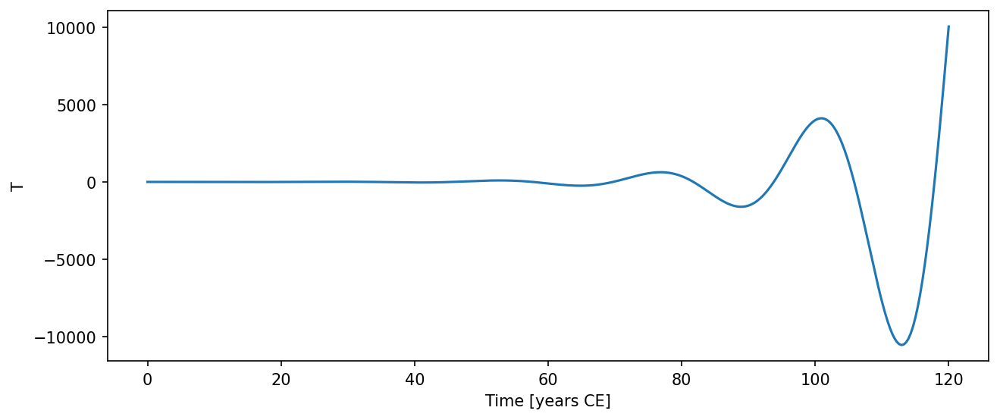

# ENSORechargeOscillator { #climatecritters.ENSORechargeOscillator }

```python
ENSORechargeOscillator(
    var_name='enso_recharge_oscillator',
    mu=0.7,
    en=0.0,
    c=1.0,
    r=0.25,
    alpha=0.125,
    b0=2.5,
    gamma=0.75,
    state_variables=None,
    diagnostic_variables=None,
    *args,
    **kwargs,
)
```

Jin-style ENSO recharge oscillator.

Couples the eastern Pacific SST anomaly ``T`` to the thermocline depth
anomaly ``h`` via a nonlinear recharge-discharge mechanism:

    dT/dt = R*T + gamma*h - en*(h + b*T)^3
    dh/dt = -r*h - alpha*b*T

where ``b = b0*mu`` and ``R = gamma*b - c``.

Seasonal or any other external forcing is added through the standard
:meth:`~climatecritters.core.CCModel.register_forcing` interface::

    from climatecritters.utils.forcing import create_sinusoid_forcing

    model = ENSORechargeOscillator()
    model.register_forcing(
        'T',
        create_sinusoid_forcing(A=0.5, period=6.0),
        attachment_style='additive',
        timing='pre',
    )

## Parameters {.doc-section .doc-section-parameters}

<code>[**var_name**]{.parameter-name} [:]{.parameter-annotation-sep} [[str](`str`)]{.parameter-annotation} [ = ]{.parameter-default-sep} [\'enso_recharge_oscillator\']{.parameter-default}</code>

:   Label for the model output.  Default ``'enso_recharge_oscillator'``.

<code>[**mu**]{.parameter-name} [:]{.parameter-annotation-sep} [[float](`float`) or [callable](`callable`) or [cc](`cc`).[Forcing](`cc.Forcing`)]{.parameter-annotation} [ = ]{.parameter-default-sep} [0.7]{.parameter-default}</code>

:   Bjerknes coupling coefficient.  Default 0.7.

<code>[**en**]{.parameter-name} [:]{.parameter-annotation-sep} [[float](`float`) or [callable](`callable`) or [cc](`cc`).[Forcing](`cc.Forcing`)]{.parameter-annotation} [ = ]{.parameter-default-sep} [0.0]{.parameter-default}</code>

:   Nonlinear damping coefficient.  Default 0.0 (linear limit).

<code>[**c**]{.parameter-name} [:]{.parameter-annotation-sep} [[float](`float`) or [callable](`callable`) or [cc](`cc`).[Forcing](`cc.Forcing`)]{.parameter-annotation} [ = ]{.parameter-default-sep} [1.0]{.parameter-default}</code>

:   Newtonian cooling rate of SST.  Default 1.0.

<code>[**r**]{.parameter-name} [:]{.parameter-annotation-sep} [[float](`float`) or [callable](`callable`) or [cc](`cc`).[Forcing](`cc.Forcing`)]{.parameter-annotation} [ = ]{.parameter-default-sep} [0.25]{.parameter-default}</code>

:   Thermocline recharge damping rate.  Default 0.25.

<code>[**alpha**]{.parameter-name} [:]{.parameter-annotation-sep} [[float](`float`) or [callable](`callable`) or [cc](`cc`).[Forcing](`cc.Forcing`)]{.parameter-annotation} [ = ]{.parameter-default-sep} [0.125]{.parameter-default}</code>

:   Wind-stress feedback strength.  Default 0.125.

<code>[**b0**]{.parameter-name} [:]{.parameter-annotation-sep} [[float](`float`) or [callable](`callable`) or [cc](`cc`).[Forcing](`cc.Forcing`)]{.parameter-annotation} [ = ]{.parameter-default-sep} [2.5]{.parameter-default}</code>

:   Background thermocline slope sensitivity.  Default 2.5.

<code>[**gamma**]{.parameter-name} [:]{.parameter-annotation-sep} [[float](`float`) or [callable](`callable`) or [cc](`cc`).[Forcing](`cc.Forcing`)]{.parameter-annotation} [ = ]{.parameter-default-sep} [0.75]{.parameter-default}</code>

:   Thermocline feedback onto SST.  Default 0.75.

## Notes {.doc-section .doc-section-notes}

State vector: ``[T, h]`` — eastern Pacific SST anomaly and thermocline
depth anomaly.

## References {.doc-section .doc-section-references}

Jin, F.-F. (1997). An equatorial ocean recharge paradigm for ENSO.
J. Atmos. Sci., 54, 811–829.

## Examples {.doc-section .doc-section-examples}

```python
import matplotlib.pyplot as plt
import climatecritters as cc
from climatecritters.model_critters.enso_recharge import ENSORechargeOscillator
from climatecritters.utils.forcing import create_sinusoid_forcing

model = ENSORechargeOscillator(mu=0.75)
model.register_forcing(
    'T',
    create_sinusoid_forcing(A=0.5, period=6.0),
    attachment_style='additive',
    timing='pre',
)
output = model.integrate(t_span=(0, 120), y0=[0.5, 0.0], method='RK45')
ts = output.to_pyleo(var_names=['T'])
ts.plot()
plt.savefig('docs/reference/figures/ENSORechargeOscillator_example.png',
            dpi=150, bbox_inches='tight')
```


