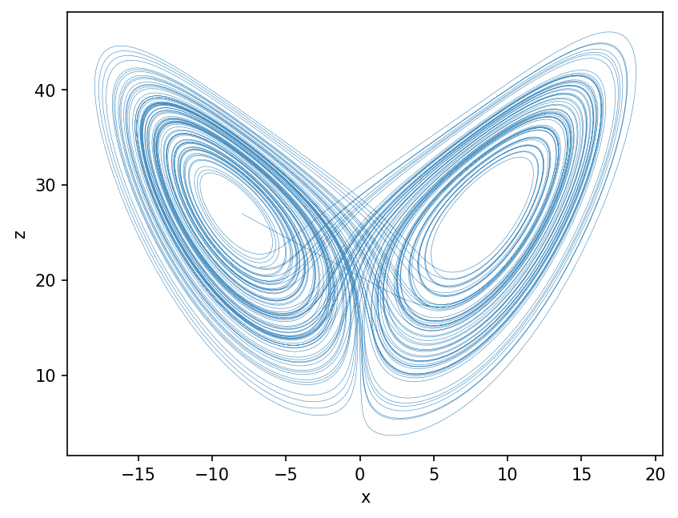

# Lorenz63 { #climatecritters.Lorenz63 }

```python
Lorenz63(
    var_name='lorenz63',
    sigma=10.0,
    rho=28.0,
    beta=8 / 3,
    state_variables=None,
    diagnostic_variables=None,
    *args,
    **kwargs,
)
```

Lorenz (1963) system.

A minimal three-variable convection model exhibiting sensitive dependence
on initial conditions and a strange attractor:

    dx/dt = sigma * (y - x)
    dy/dt = x * (rho - z) - y
    dz/dt = x * y - beta * z

## Parameters {.doc-section .doc-section-parameters}

<code>[**var_name**]{.parameter-name} [:]{.parameter-annotation-sep} [[str](`str`)]{.parameter-annotation} [ = ]{.parameter-default-sep} [\'lorenz63\']{.parameter-default}</code>

:   Label for the model output.  Default ``'lorenz63'``.

<code>[**sigma**]{.parameter-name} [:]{.parameter-annotation-sep} [[float](`float`) or [callable](`callable`) or [cc](`cc`).[Forcing](`cc.Forcing`)]{.parameter-annotation} [ = ]{.parameter-default-sep} [10.0]{.parameter-default}</code>

:   Prandtl number controlling rotation of convective rolls.  Default 10.

<code>[**rho**]{.parameter-name} [:]{.parameter-annotation-sep} [[float](`float`) or [callable](`callable`) or [cc](`cc`).[Forcing](`cc.Forcing`)]{.parameter-annotation} [ = ]{.parameter-default-sep} [28.0]{.parameter-default}</code>

:   Rayleigh number (reduced) controlling the buoyancy forcing. Default 28.

<code>[**beta**]{.parameter-name} [:]{.parameter-annotation-sep} [[float](`float`) or [callable](`callable`) or [cc](`cc`).[Forcing](`cc.Forcing`)]{.parameter-annotation} [ = ]{.parameter-default-sep} [8 / 3]{.parameter-default}</code>

:   Geometric factor controlling the spatial structure.  Default 8/3.

## Notes {.doc-section .doc-section-notes}

The classic strange attractor exists for ``sigma=10``, ``rho=28``,
``beta=8/3``.  Time-varying parameters are supported as callables with
signatures ``(t)``, ``(t, state)``, or ``(t, state, model)``.

State variables are ``x``, ``y``, ``z`` in that order.

## References {.doc-section .doc-section-references}

Lorenz, E. N. (1963). J. Atmos. Sci., 20, 130–141.

## Examples {.doc-section .doc-section-examples}

```python
import matplotlib.pyplot as plt
import climatecritters as cc
from climatecritters.model_critters.lorenz import Lorenz63

model = Lorenz63()
output = model.integrate(
    t_span=(0, 100), y0=[-8.0, 8.0, 27.0], method='RK45'
)
fig, ax = plt.subplots()
ax.plot(output.state_variables['x'], output.state_variables['z'],
        lw=0.3, alpha=0.8)
ax.set_xlabel('x'); ax.set_ylabel('z')
plt.savefig('docs/reference/figures/Lorenz63_example.png',
            dpi=150, bbox_inches='tight')
```


