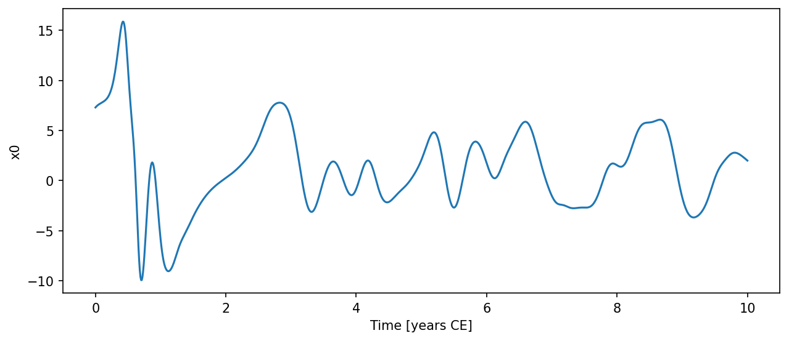

# Lorenz96 { #climatecritters.Lorenz96 }

```python
Lorenz96(
    var_name='lorenz96',
    n=40,
    J=0,
    F=8.0,
    h=1.0,
    b=10.0,
    c=10.0,
    exact_rhs=False,
    state_variables=None,
    diagnostic_variables=None,
    *args,
    **kwargs,
)
```

Lorenz (1996) single-scale and two-scale atmospheric model.

A periodic ring of *n* slow-scale variables with quadratic advection and
constant forcing:

    dX_k/dt = (X_{k+1} - X_{k-2}) * X_{k-1} - X_k + F

When *J* > 0 a second, faster Y layer of *n* × *J* variables is coupled
to the slow layer (the two-scale system of Lorenz & Emanuel 1998):

    dX_k/dt = ... - (h*c/b) * sum_j Y_{j,k}
    dY_{j,k}/dt = -c*b * Y_{j+1,k} * (Y_{j+2,k} - Y_{j-1,k}) - c*Y_{j,k} + (h*c/b)*X_k

## Parameters {.doc-section .doc-section-parameters}

<code>[**var_name**]{.parameter-name} [:]{.parameter-annotation-sep} [[str](`str`)]{.parameter-annotation} [ = ]{.parameter-default-sep} [\'lorenz96\']{.parameter-default}</code>

:   Label for the model output.  Default ``'lorenz96'``.

<code>[**n**]{.parameter-name} [:]{.parameter-annotation-sep} [[int](`int`)]{.parameter-annotation} [ = ]{.parameter-default-sep} [40]{.parameter-default}</code>

:   Number of slow-scale variables.  Default 40.

<code>[**J**]{.parameter-name} [:]{.parameter-annotation-sep} [[int](`int`)]{.parameter-annotation} [ = ]{.parameter-default-sep} [0]{.parameter-default}</code>

:   Fast variables per slow variable.  ``J=0`` (default) gives the single-scale system; ``J>0`` activates the two-scale system.

<code>[**F**]{.parameter-name} [:]{.parameter-annotation-sep} [[float](`float`) or [callable](`callable`) or [cc](`cc`).[Forcing](`cc.Forcing`)]{.parameter-annotation} [ = ]{.parameter-default-sep} [8.0]{.parameter-default}</code>

:   Slow-scale forcing amplitude.  Default 8.0.  Pass a time-varying signal via ``model.register_forcing('F', forcing_obj)``.

<code>[**h**]{.parameter-name} [:]{.parameter-annotation-sep} [[float](`float`)]{.parameter-annotation} [ = ]{.parameter-default-sep} [1.0]{.parameter-default}</code>

:   Coupling coefficient between X and Y layers (two-scale only). Default 1.0.

<code>[**b**]{.parameter-name} [:]{.parameter-annotation-sep} [[float](`float`)]{.parameter-annotation} [ = ]{.parameter-default-sep} [10.0]{.parameter-default}</code>

:   Amplitude ratio Y/X (two-scale only).  Default 10.0.

<code>[**c**]{.parameter-name} [:]{.parameter-annotation-sep} [[float](`float`)]{.parameter-annotation} [ = ]{.parameter-default-sep} [10.0]{.parameter-default}</code>

:   Timescale ratio Y/X (two-scale only).  Default 10.0.

<code>[**exact_rhs**]{.parameter-name} [:]{.parameter-annotation-sep} [[bool](`bool`)]{.parameter-annotation} [ = ]{.parameter-default-sep} [False]{.parameter-default}</code>

:   If ``True``, use global ``np.roll`` on the flattened Y vector, matching the original L96_model.py reference implementation. Default ``False`` (per-block loop, identical results).

## Notes {.doc-section .doc-section-notes}

For the two-scale system (``J>0``) use ``method='rk4'`` with a small
fixed time step passed directly to ``integrate``::

    output = model.integrate(t_span=..., y0=..., method='rk4',
                             dt=0.005, kwargs={'si': 0.05})

Adaptive solvers (RK45) call ``dydt`` at unpredictable sub-steps; the
fixed-step RK4 avoids this problem.  Plain Euler is too coarse to
resolve the fast Y dynamics.

## References {.doc-section .doc-section-references}

Lorenz, E. N. (1996). Predictability: A problem partly solved.
Lorenz, E. N., & Emanuel, K. A. (1998). J. Atmos. Sci., 55, 399–414.

## Examples {.doc-section .doc-section-examples}

```python
import matplotlib.pyplot as plt
import numpy as np
import climatecritters as cc
from climatecritters.model_critters.lorenz import Lorenz96

# Single-scale system
model = Lorenz96(n=40, F=8.0)
y0 = np.random.randn(40) + 8.0
output = model.integrate(t_span=(0, 10), y0=y0, method='rk4', dt=0.01)
ts = output.to_pyleo(var_names=['x0'])

# Two-scale system
K, J = 36, 10
model2 = Lorenz96(n=K, J=J, F=10.0)
y0_2 = np.concatenate([np.random.randn(K) + 10.0,
                        np.random.randn(K * J) * 0.01])
output2 = model2.integrate(t_span=(0, 10), y0=y0_2,
                           method='rk4', dt=0.005,
                           kwargs={'si': 0.05})
ts = output.to_pyleo(var_names=['x0'])
ts.plot()
plt.savefig('docs/reference/figures/Lorenz96_example.png',
            dpi=150, bbox_inches='tight')
```


