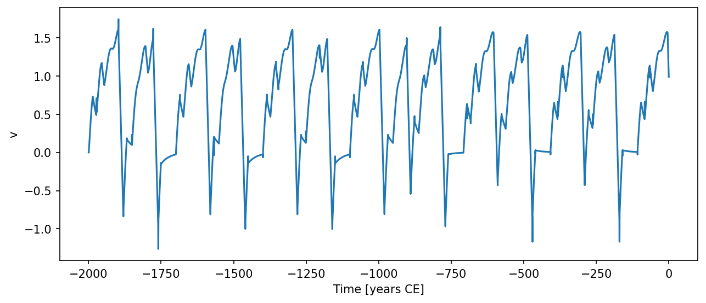

# Model3 { #climatecritters.Model3 }

```python
Model3(
    var_name='ice volume',
    f1=-16,
    f2=16,
    t1=30,
    t2=10,
    vc=1.4,
    insolation=0.0,
    state_variables=['v', 'k'],
    non_integrated_state_vars=['k'],
    diagnostic_variables=['insolation'],
    *args,
    **kwargs,
)
```

Model 3 from Ganopolski (2024) describing glacial cycle evolution under orbital forcing.

The model tracks ice volume ``v`` and glacial regime ``k`` (1 = glaciation,
2 = deglaciation).  The ice volume relaxes toward a forcing-dependent
equilibrium:

    dv/dt = (ve(f) - v) / t1    when k=1  (glaciation)
    dv/dt = -vc / t2             when k=2  (deglaciation)

Regime switches follow:

- k=1 → k=2  if v > vc, df/dt > 0, and f > 0
- k=2 → k=1  if f < f1

## Parameters {.doc-section .doc-section-parameters}

<code>[**var_name**]{.parameter-name} [:]{.parameter-annotation-sep} [[str](`str`)]{.parameter-annotation} [ = ]{.parameter-default-sep} [\'ice volume\']{.parameter-default}</code>

:   Label for the model output.  Default ``'ice volume'``.

<code>[**f1**]{.parameter-name} [:]{.parameter-annotation-sep} [[float](`float`) or [callable](`callable`) or [cc](`cc`).[Forcing](`cc.Forcing`)]{.parameter-annotation} [ = ]{.parameter-default-sep} [-16]{.parameter-default}</code>

:   Insolation threshold for glacial inception (W/m^2; typically -20 to -15).  Default -16.

<code>[**f2**]{.parameter-name} [:]{.parameter-annotation-sep} [[float](`float`) or [callable](`callable`) or [cc](`cc`).[Forcing](`cc.Forcing`)]{.parameter-annotation} [ = ]{.parameter-default-sep} [16]{.parameter-default}</code>

:   Insolation threshold for deglaciation inception (W/m^2; typically positive).  Default 16.

<code>[**t1**]{.parameter-name} [:]{.parameter-annotation-sep} [[float](`float`) or [callable](`callable`) or [cc](`cc`).[Forcing](`cc.Forcing`)]{.parameter-annotation} [ = ]{.parameter-default-sep} [30]{.parameter-default}</code>

:   Relaxation timescale for glacial inception (kyr).  Default 30.

<code>[**t2**]{.parameter-name} [:]{.parameter-annotation-sep} [[float](`float`) or [callable](`callable`) or [cc](`cc`).[Forcing](`cc.Forcing`)]{.parameter-annotation} [ = ]{.parameter-default-sep} [10]{.parameter-default}</code>

:   Relaxation timescale for deglaciation (kyr).  Default 10.

<code>[**vc**]{.parameter-name} [:]{.parameter-annotation-sep} [[float](`float`) or [callable](`callable`) or [cc](`cc`).[Forcing](`cc.Forcing`)]{.parameter-annotation} [ = ]{.parameter-default-sep} [1.4]{.parameter-default}</code>

:   Critical ice volume controlling dominant periodicity and asymmetry. Default 1.4.

## Notes {.doc-section .doc-section-notes}

State variables are ``v`` (ice volume, normalised) and ``k`` (regime
index, non-integrated).  The diagnostic variable ``insolation`` records
``f(t)`` at each output step.

The ``insolation`` parameter (default 0.0) provides the orbital forcing
value used by the model.  Register a time-varying orbital signal via::

    model.register_forcing('insolation', cc.Forcing(calc_f))

The internal derivative of forcing ``dfdt`` is computed via
:func:`calc_df` by default; supply a custom callable or
``cc.Forcing`` to override.

Parameter defaults are taken from Ganopolski (2024).  Time-varying
parameters follow the standard callable contract ``(t)``,
``(t, state)``, or ``(t, state, model)``.

## References {.doc-section .doc-section-references}

Ganopolski, A. (2024). Glacial cycles. *Nature Reviews Earth &
Environment*, 5, 89–106.

## Examples {.doc-section .doc-section-examples}

```python
import climatecritters as cc
from climatecritters.model_critters.g24 import Model3, calc_f
import matplotlib.pyplot as plt

model = Model3()
model.register_forcing('insolation', cc.Forcing(calc_f))

output = model.integrate(
    t_span=(-2000, 0), y0=[0.0, 1], method='RK45',
    kwargs={'max_step': 0.5}
)
ts = output.to_pyleo(var_names=['v'])
ts.plot()
plt.savefig('docs/reference/figures/Model3_example.png',
            dpi=150, bbox_inches='tight')
```




## Methods

| Name | Description |
| --- | --- |
| [calc_dfdt](#climatecritters.Model3.calc_dfdt) | Evaluate df/dt — the time derivative of the orbital forcing at time ``t``. |
| [calc_vc](#climatecritters.Model3.calc_vc) | Evaluate the critical ice volume ``vc`` (constant or time/state-varying). |
| [calc_ve](#climatecritters.Model3.calc_ve) | Equilibrium ice volume toward which the system is attracted. |
| [calc_vg](#climatecritters.Model3.calc_vg) | Glacial equilibrium ice volume. |
| [calc_vu](#climatecritters.Model3.calc_vu) | Unstable equilibrium ice volume separating glacial and interglacial basins. |
| [dydt](#climatecritters.Model3.dydt) | Evaluate ice-volume tendency at time ``t`` and state ``x``. |

### calc_dfdt { #climatecritters.Model3.calc_dfdt }

```python
Model3.calc_dfdt(t, x=None)
```

Evaluate df/dt — the time derivative of the orbital forcing at time ``t``.

### calc_vc { #climatecritters.Model3.calc_vc }

```python
Model3.calc_vc(t, x=None)
```

Evaluate the critical ice volume ``vc`` (constant or time/state-varying).

### calc_ve { #climatecritters.Model3.calc_ve }

```python
Model3.calc_ve(v, f, f1, f2, vi=0)
```

Equilibrium ice volume toward which the system is attracted.

In the bi-stable regime (``f1 < f < f2``) the target depends on the
current ice volume ``v`` relative to the unstable equilibrium ``vu``.

#### Parameters {.doc-section .doc-section-parameters}

<code>[**v**]{.parameter-name} [:]{.parameter-annotation-sep} [[float](`float`)]{.parameter-annotation}</code>

:   Current ice volume (normalised).

<code>[**f**]{.parameter-name} [:]{.parameter-annotation-sep} [[float](`float`)]{.parameter-annotation}</code>

:   Orbital forcing value (W/m^2).

<code>[**f1**]{.parameter-name} [:]{.parameter-annotation-sep} [[float](`float`)]{.parameter-annotation}</code>

:   Lower insolation threshold (glaciation onset).

<code>[**f2**]{.parameter-name} [:]{.parameter-annotation-sep} [[float](`float`)]{.parameter-annotation}</code>

:   Upper insolation threshold (deglaciation onset).

<code>[**vi**]{.parameter-name} [:]{.parameter-annotation-sep} [[float](`float`)]{.parameter-annotation} [ = ]{.parameter-default-sep} [0]{.parameter-default}</code>

:   Interglacial equilibrium ice volume.  Default 0.

#### Returns {.doc-section .doc-section-returns}

<code>[**ve**]{.parameter-name} [:]{.parameter-annotation-sep} [[float](`float`)]{.parameter-annotation}</code>

:   Target equilibrium ice volume.

### calc_vg { #climatecritters.Model3.calc_vg }

```python
Model3.calc_vg(f, f1, f2)
```

Glacial equilibrium ice volume.

#### Parameters {.doc-section .doc-section-parameters}

<code>[**f**]{.parameter-name} [:]{.parameter-annotation-sep} [[float](`float`)]{.parameter-annotation}</code>

:   Orbital forcing value (W/m^2).

<code>[**f1**]{.parameter-name} [:]{.parameter-annotation-sep} [[float](`float`)]{.parameter-annotation}</code>

:   Lower insolation threshold.

<code>[**f2**]{.parameter-name} [:]{.parameter-annotation-sep} [[float](`float`)]{.parameter-annotation}</code>

:   Upper insolation threshold.

#### Returns {.doc-section .doc-section-returns}

<code>[**vg**]{.parameter-name} [:]{.parameter-annotation-sep} [[float](`float`)]{.parameter-annotation}</code>

:   Glacial equilibrium ice volume.

### calc_vu { #climatecritters.Model3.calc_vu }

```python
Model3.calc_vu(f, f1, f2)
```

Unstable equilibrium ice volume separating glacial and interglacial basins.

#### Parameters {.doc-section .doc-section-parameters}

<code>[**f**]{.parameter-name} [:]{.parameter-annotation-sep} [[float](`float`)]{.parameter-annotation}</code>

:   Orbital forcing value (W/m^2).

<code>[**f1**]{.parameter-name} [:]{.parameter-annotation-sep} [[float](`float`)]{.parameter-annotation}</code>

:   Lower insolation threshold.

<code>[**f2**]{.parameter-name} [:]{.parameter-annotation-sep} [[float](`float`)]{.parameter-annotation}</code>

:   Upper insolation threshold.

#### Returns {.doc-section .doc-section-returns}

<code>[**vu**]{.parameter-name} [:]{.parameter-annotation-sep} [[float](`float`)]{.parameter-annotation}</code>

:   Unstable equilibrium ice volume.

### dydt { #climatecritters.Model3.dydt }

```python
Model3.dydt(t, x)
```

Evaluate ice-volume tendency at time ``t`` and state ``x``.

#### Returns {.doc-section .doc-section-returns}

<code>[]{.parameter-name} [:]{.parameter-annotation-sep} [list of float]{.parameter-annotation}</code>

:   ``[dvdt]`` — the ice-volume tendency.  The regime index ``k`` is a non-integrated state variable updated in-place.