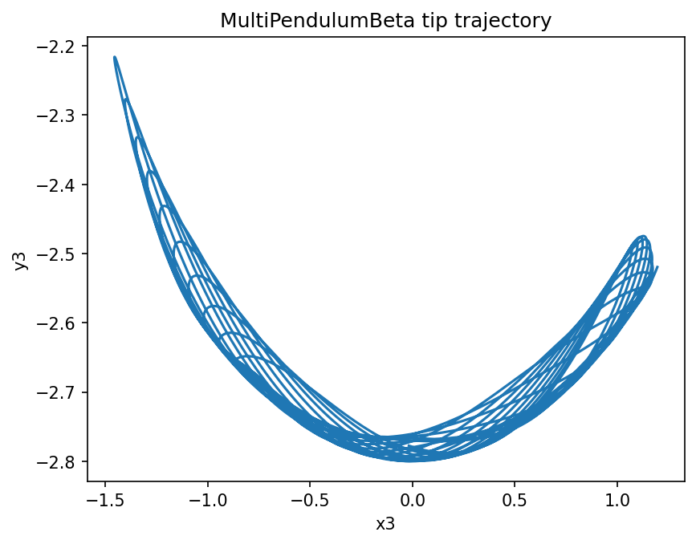

# MultiPendulumBeta { #climatecritters.MultiPendulumBeta }

```python
MultiPendulumBeta(
    rods,
    g=9.81,
    var_name='multi_pendulum_beta',
    state_variables=None,
    diagnostic_variables=None,
    *args,
    **kwargs,
)
```

Experimental N-rod chain pendulum solved via a Lagrangian mass matrix.

This beta model generalizes the double pendulum to an arbitrary chain of
rigid, massless rods with point masses at their tips. At each timestep it
assembles the symmetric mass matrix ``M(theta)`` and torque vector
``tau(theta, omega)`` and solves ``M @ alpha = tau`` for the angular
accelerations.

State variables are interleaved as
``[theta1, omega1, theta2, omega2, ..., thetaN, omegaN]``.
Diagnostics are computed after integration and include total mechanical
energy plus Cartesian bob positions ``x1, y1, ..., xN, yN``.

## Parameters {.doc-section .doc-section-parameters}

<code>[**rods**]{.parameter-name} [:]{.parameter-annotation-sep} []{.parameter-annotation}</code>

:   Sequence of :class:`PendulumRodBeta` in pivot-to-tip order. Must contain at least two rods.

<code>[**g**]{.parameter-name} [:]{.parameter-annotation-sep} []{.parameter-annotation} [ = ]{.parameter-default-sep} [9.81]{.parameter-default}</code>

:   Gravitational acceleration in m/s^2. Must be > 0.

<code>[**var_name**]{.parameter-name} [:]{.parameter-annotation-sep} []{.parameter-annotation} [ = ]{.parameter-default-sep} [\'multi_pendulum_beta\']{.parameter-default}</code>

:   Human-readable label.

<code>[**state_variables**]{.parameter-name} [:]{.parameter-annotation-sep} []{.parameter-annotation} [ = ]{.parameter-default-sep} [None]{.parameter-default}</code>

:   Defaults to ``['theta1', 'omega1', 'theta2', 'omega2', ...]``.

<code>[**diagnostic_variables**]{.parameter-name} [:]{.parameter-annotation-sep} []{.parameter-annotation} [ = ]{.parameter-default-sep} [None]{.parameter-default}</code>

:   Defaults to ``['energy', 'x1', 'y1', 'x2', 'y2', ...]``.

## Notes {.doc-section .doc-section-notes}

This class is intentionally marked beta because it extends the existing
pendulum family with a more general mass-matrix formulation that has less
long-term usage history in ClimateCritters than the simple, driven, and
closed-form double pendulum models.

## Examples {.doc-section .doc-section-examples}

```python
import matplotlib.pyplot as plt
from climatecritters.model_critters.pendulum import (
    MultiPendulumBeta,
    PendulumRodBeta,
)

rods = [
    PendulumRodBeta(m=1.0, L=1.0),
    PendulumRodBeta(m=1.0, L=1.0, damping=0.2),
    PendulumRodBeta(m=0.5, L=0.8),
]
model = MultiPendulumBeta(rods=rods, g=9.81)
output = model.integrate(
    t_span=(0, 30),
    y0=[0.5, 0.0, 0.5, 0.0, 0.3, 0.0],
    method='RK45',
    kwargs={'rtol': 1e-10, 'atol': 1e-12},
)
fig, ax = plt.subplots()
ax.plot(output.diagnostic_variables['x3'], output.diagnostic_variables['y3'])
ax.set_xlabel('x3')
ax.set_ylabel('y3')
ax.set_title('MultiPendulumBeta tip trajectory')
plt.savefig('docs/reference/figures/MultiPendulumBeta_example.png',
            dpi=150, bbox_inches='tight')
```




## Methods

| Name | Description |
| --- | --- |
| [cartesian_positions](#climatecritters.MultiPendulumBeta.cartesian_positions) | Return ``(x1, y1, x2, y2, ..., xN, yN)`` from the last run. |

### cartesian_positions { #climatecritters.MultiPendulumBeta.cartesian_positions }

```python
MultiPendulumBeta.cartesian_positions()
```

Return ``(x1, y1, x2, y2, ..., xN, yN)`` from the last run.