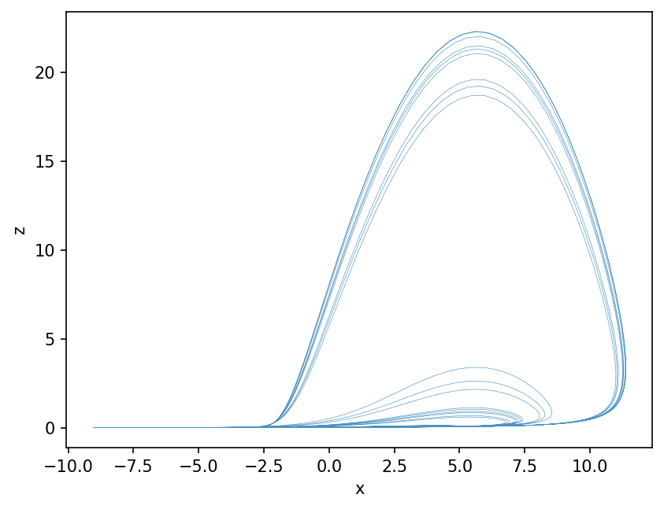

# Roessler { #climatecritters.Roessler }

```python
Roessler(
    var_name='roessler',
    a=0.2,
    b=0.2,
    c=5.7,
    state_variables=None,
    diagnostic_variables=None,
    *args,
    **kwargs,
)
```

Roessler chaotic oscillator.

A three-variable continuous-time system with a single scroll attractor:

    dx/dt = -y - z
    dy/dt = x + a*y
    dz/dt = b + z*(x - c)

## Parameters {.doc-section .doc-section-parameters}

<code>[**var_name**]{.parameter-name} [:]{.parameter-annotation-sep} [[str](`str`)]{.parameter-annotation} [ = ]{.parameter-default-sep} [\'roessler\']{.parameter-default}</code>

:   Label for the model output.  Default ``'roessler'``.

<code>[**a**]{.parameter-name} [:]{.parameter-annotation-sep} [[float](`float`) or [callable](`callable`) or [cc](`cc`).[Forcing](`cc.Forcing`)]{.parameter-annotation} [ = ]{.parameter-default-sep} [0.2]{.parameter-default}</code>

:   Controls the strength of the y-feedback.  Default 0.2.

<code>[**b**]{.parameter-name} [:]{.parameter-annotation-sep} [[float](`float`) or [callable](`callable`) or [cc](`cc`).[Forcing](`cc.Forcing`)]{.parameter-annotation} [ = ]{.parameter-default-sep} [0.2]{.parameter-default}</code>

:   Offset in the z equation.  Default 0.2.

<code>[**c**]{.parameter-name} [:]{.parameter-annotation-sep} [[float](`float`) or [callable](`callable`) or [cc](`cc`).[Forcing](`cc.Forcing`)]{.parameter-annotation} [ = ]{.parameter-default-sep} [5.7]{.parameter-default}</code>

:   Nonlinear threshold in the z equation.  Default 5.7.

## Notes {.doc-section .doc-section-notes}

The canonical chaotic attractor exists near ``a=b=0.2``, ``c=5.7``.
State variables are ``x``, ``y``, ``z`` in that order.
Time-varying parameters are resolved through ``get_param_value`` and
support callables with signatures ``(t)``, ``(t, state)``, or
``(t, state, model)``.

## References {.doc-section .doc-section-references}

Rössler, O. E. (1976). Phys. Lett. A, 57(5), 397–398.

## Examples {.doc-section .doc-section-examples}

```python
import matplotlib.pyplot as plt
from climatecritters.model_critters.roessler import Roessler

model = Roessler()
output = model.integrate(
    t_span=(0, 200), y0=[0.1, 0.0, 0.0], method='RK45'
)
fig, ax = plt.subplots()
ax.plot(output.state_variables['x'], output.state_variables['z'],
        lw=0.3, alpha=0.8)
ax.set_xlabel('x'); ax.set_ylabel('z')
plt.savefig('docs/reference/figures/Roessler_example.png',
            dpi=150, bbox_inches='tight')
```


