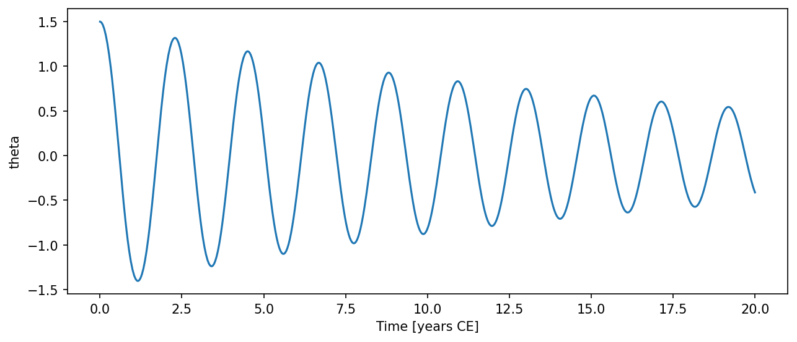

# SimplePendulum { #climatecritters.SimplePendulum }

```python
SimplePendulum(
    var_name='simple_pendulum',
    L=1.0,
    g=9.81,
    damping=0.0,
    state_variables=None,
    diagnostic_variables=None,
    *args,
    **kwargs,
)
```

Nonlinear pendulum with optional linear damping.

## Parameters {.doc-section .doc-section-parameters}

<code>[**var_name**]{.parameter-name} [:]{.parameter-annotation-sep} []{.parameter-annotation} [ = ]{.parameter-default-sep} [\'simple_pendulum\']{.parameter-default}</code>

:   Human-readable label.

<code>[**L**]{.parameter-name} [:]{.parameter-annotation-sep} []{.parameter-annotation} [ = ]{.parameter-default-sep} [1.0]{.parameter-default}</code>

:   Pendulum length in metres.  Must be > 0.

<code>[**g**]{.parameter-name} [:]{.parameter-annotation-sep} []{.parameter-annotation} [ = ]{.parameter-default-sep} [9.81]{.parameter-default}</code>

:   Gravitational acceleration in m/s².  Must be > 0.

<code>[**damping**]{.parameter-name} [:]{.parameter-annotation-sep} []{.parameter-annotation} [ = ]{.parameter-default-sep} [0.0]{.parameter-default}</code>

:   Linear damping coefficient λ (s⁻¹).  ``damping=0`` gives undamped SHM.

<code>[**state_variables**]{.parameter-name} [:]{.parameter-annotation-sep} []{.parameter-annotation} [ = ]{.parameter-default-sep} [None]{.parameter-default}</code>

:   Names for [angle, angular velocity].

<code>[**diagnostic_variables**]{.parameter-name} [:]{.parameter-annotation-sep} []{.parameter-annotation} [ = ]{.parameter-default-sep} [None]{.parameter-default}</code>

:   Names for post-integration diagnostics.

## Notes {.doc-section .doc-section-notes}

State variables are ``theta`` (angle, rad) and ``omega`` (angular velocity,
rad/s) in that order.  Diagnostic variables ``energy`` and ``omega_0`` are
computed after integration.

## Examples {.doc-section .doc-section-examples}

```python
import matplotlib.pyplot as plt
from climatecritters.model_critters.pendulum import SimplePendulum

model = SimplePendulum(L=1.0, g=9.81, damping=0.1)
output = model.integrate(t_span=(0, 20), y0=[1.5, 0.0], method='RK45')
ts = output.to_pyleo(var_names=['theta'])
ts.plot()
plt.savefig('docs/reference/figures/SimplePendulum_example.png',
            dpi=150, bbox_inches='tight')
```




## Methods

| Name | Description |
| --- | --- |
| [damping_ratio](#climatecritters.SimplePendulum.damping_ratio) | Return ζ = λ / (2ω₀).  ζ < 1 underdamped, ζ = 1 critical. |
| [natural_frequency](#climatecritters.SimplePendulum.natural_frequency) | Return ω₀ = √(g/L) in rad/s. |
| [natural_period](#climatecritters.SimplePendulum.natural_period) | Return T₀ = 2π/ω₀ in seconds (small-angle approximation). |

### damping_ratio { #climatecritters.SimplePendulum.damping_ratio }

```python
SimplePendulum.damping_ratio()
```

Return ζ = λ / (2ω₀).  ζ < 1 underdamped, ζ = 1 critical.

### natural_frequency { #climatecritters.SimplePendulum.natural_frequency }

```python
SimplePendulum.natural_frequency()
```

Return ω₀ = √(g/L) in rad/s.

### natural_period { #climatecritters.SimplePendulum.natural_period }

```python
SimplePendulum.natural_period()
```

Return T₀ = 2π/ω₀ in seconds (small-angle approximation).