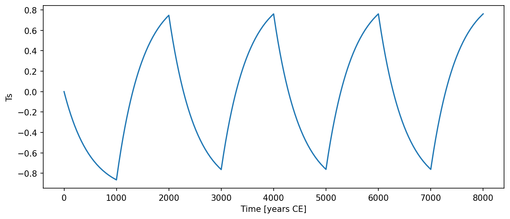

# Stocker2003BipolarSeesaw { #climatecritters.Stocker2003BipolarSeesaw }

```python
Stocker2003BipolarSeesaw(
    var_name='stocker2003_bipolar_seesaw',
    tau=1000.0,
    beta=-1.0,
    Tn=0.0,
    state_variables=None,
    diagnostic_variables=None,
    *args,
    **kwargs,
)
```

Minimum thermodynamic model for the thermal bipolar seesaw.

A single prognostic southern temperature anomaly ``Ts`` relaxes toward
a northern temperature signal ``Tn(t)`` scaled by ``beta``:

    dTs/dt = (beta*Tn(t) - Ts) / tau

## Parameters {.doc-section .doc-section-parameters}

<code>[**var_name**]{.parameter-name} [:]{.parameter-annotation-sep} [[str](`str`)]{.parameter-annotation} [ = ]{.parameter-default-sep} [\'stocker2003_bipolar_seesaw\']{.parameter-default}</code>

:   Label for the model output.  Default ``'stocker2003_bipolar_seesaw'``.

<code>[**tau**]{.parameter-name} [:]{.parameter-annotation-sep} [[float](`float`) or [callable](`callable`) or [cc](`cc`).[Forcing](`cc.Forcing`)]{.parameter-annotation} [ = ]{.parameter-default-sep} [1000.0]{.parameter-default}</code>

:   Thermal equilibration timescale (years).  Must be > 0.  Default 1000.

<code>[**beta**]{.parameter-name} [:]{.parameter-annotation-sep} [[float](`float`) or [callable](`callable`) or [cc](`cc`).[Forcing](`cc.Forcing`)]{.parameter-annotation} [ = ]{.parameter-default-sep} [-1.0]{.parameter-default}</code>

:   Amplitude ratio relating southern to northern anomaly.  Default -1.0 (antiphase seesaw).

<code>[**Tn**]{.parameter-name} [:]{.parameter-annotation-sep} [[float](`float`) or [callable](`callable`) or [cc](`cc`).[Forcing](`cc.Forcing`)]{.parameter-annotation} [ = ]{.parameter-default-sep} [0.0]{.parameter-default}</code>

:   Northern temperature anomaly.  Default 0.0.  Register a time-varying signal via ``model.register_forcing('Tn', forcing_obj)``.

## Notes {.doc-section .doc-section-notes}

The diagnostic variable ``Tn`` (northern temperature) is written by
``populate_diagnostics_from_history`` after integration.  State variable
is ``Ts``.

## References {.doc-section .doc-section-references}

Stocker, T. F., & Johnsen, S. J. (2003). A minimum thermodynamic model
for the bipolar seesaw. Paleoceanography, 18(4), 1087.

## Examples {.doc-section .doc-section-examples}

```python
import numpy as np
import climatecritters as cc
from climatecritters.model_critters.stocker2003_bipolar_seesaw import (
    Stocker2003BipolarSeesaw,
)

import matplotlib.pyplot as plt

model = Stocker2003BipolarSeesaw(tau=500.0, beta=-1.0)
model.register_forcing('Tn', cc.Forcing(lambda t: 1.0 if (t % 2000) < 1000 else -1.0))
output = model.integrate(
    t_span=(0, 8000), y0=[0.0], method='RK45'
)
ts = output.to_pyleo(var_names=['Ts'])
ts.plot()
plt.savefig('docs/reference/figures/Stocker2003BipolarSeesaw_example.png',
            dpi=150, bbox_inches='tight')
```


