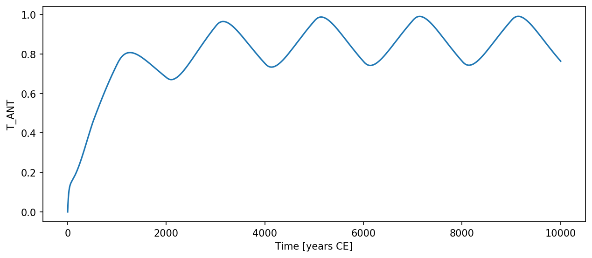

# Stocker2003ExtendedSeaIceSeesaw { #climatecritters.Stocker2003ExtendedSeaIceSeesaw }

```python
Stocker2003ExtendedSeaIceSeesaw(
    var_name='stocker2003_extended_seaice_seesaw',
    tau_R=300.0,
    tau_S=1200.0,
    tau_A=100.0,
    tau_ANT=20.0,
    kappa=1.0,
    lambda_S=0.2,
    alpha=0.3,
    beta=0.2,
    gamma=4.0,
    delta=1.0,
    eta=0.2,
    T_S0=0.0,
    T_c=0.0,
    T_N=0.0,
    epsilon_R=0.0,
    epsilon_S=0.0,
    epsilon_A=0.0,
    epsilon_ANT=0.0,
    state_variables=None,
    diagnostic_variables=None,
    *args,
    **kwargs,
)
```

Extended Stocker-style model with reservoir, Southern Ocean, sea-ice, and Antarctic states.

The model integrates four coupled ODEs with prescribed northern forcing
``T_N(t)``:

    tau_R * dT_R/dt     = -(T_R - T_N) + eps_R
    tau_S * dT_S/dt     = kappa*(T_R - T_S) - lambda_S*(T_S - T_S0)
                          + alpha*(1 - A) + eps_S
    tau_A * dA/dt       = -beta*(T_S - T_S0)
                          - gamma*A*(1-A)*(T_S - T_c) + eps_A
    tau_ANT * dT_ANT/dt = delta*(T_S - T_ANT) + eta*(1 - A) + eps_ANT

Sea-ice area fraction ``A`` is constrained to [0, 1] by suppressing
the outward derivative at the physical boundaries inside ``dydt``.

## Parameters {.doc-section .doc-section-parameters}

<code>[**var_name**]{.parameter-name} [:]{.parameter-annotation-sep} [[str](`str`)]{.parameter-annotation} [ = ]{.parameter-default-sep} [\'stocker2003_extended_seaice_seesaw\']{.parameter-default}</code>

:   Label for the model output.  Default ``'stocker2003_extended_seaice_seesaw'``.

<code>[**tau_R**]{.parameter-name} [:]{.parameter-annotation-sep} [[float](`float`)]{.parameter-annotation} [ = ]{.parameter-default-sep} [300.0]{.parameter-default}</code>

:   Oceanic reservoir relaxation timescale (years).  Default 300.

<code>[**tau_S**]{.parameter-name} [:]{.parameter-annotation-sep} [[float](`float`)]{.parameter-annotation} [ = ]{.parameter-default-sep} [1200.0]{.parameter-default}</code>

:   Southern Ocean relaxation timescale (years).  Default 1200.

<code>[**tau_A**]{.parameter-name} [:]{.parameter-annotation-sep} [[float](`float`)]{.parameter-annotation} [ = ]{.parameter-default-sep} [100.0]{.parameter-default}</code>

:   Sea-ice adjustment timescale (years).  Default 100.

<code>[**tau_ANT**]{.parameter-name} [:]{.parameter-annotation-sep} [[float](`float`)]{.parameter-annotation} [ = ]{.parameter-default-sep} [20.0]{.parameter-default}</code>

:   Antarctic temperature adjustment timescale (years).  Default 20.

<code>[**kappa**]{.parameter-name} [:]{.parameter-annotation-sep} [[float](`float`)]{.parameter-annotation} [ = ]{.parameter-default-sep} [1.0]{.parameter-default}</code>

:   Advective heat exchange between reservoir and Southern Ocean. Default 1.0.

<code>[**lambda_S**]{.parameter-name} [:]{.parameter-annotation-sep} [[float](`float`)]{.parameter-annotation} [ = ]{.parameter-default-sep} [0.2]{.parameter-default}</code>

:   Linear restoring rate for Southern Ocean temperature.  Default 0.2.

<code>[**alpha**]{.parameter-name} [:]{.parameter-annotation-sep} [[float](`float`)]{.parameter-annotation} [ = ]{.parameter-default-sep} [0.3]{.parameter-default}</code>

:   Sea-ice insulation effect on Southern Ocean heat flux.  Default 0.3.

<code>[**beta**]{.parameter-name} [:]{.parameter-annotation-sep} [[float](`float`)]{.parameter-annotation} [ = ]{.parameter-default-sep} [0.2]{.parameter-default}</code>

:   Temperature-driven sea-ice melt rate.  Default 0.2.

<code>[**gamma**]{.parameter-name} [:]{.parameter-annotation-sep} [[float](`float`)]{.parameter-annotation} [ = ]{.parameter-default-sep} [4.0]{.parameter-default}</code>

:   Nonlinear sea-ice feedback strength.  Default 4.0.

<code>[**delta**]{.parameter-name} [:]{.parameter-annotation-sep} [[float](`float`)]{.parameter-annotation} [ = ]{.parameter-default-sep} [1.0]{.parameter-default}</code>

:   Southern Ocean to Antarctic heat coupling.  Default 1.0.

<code>[**eta**]{.parameter-name} [:]{.parameter-annotation-sep} [[float](`float`)]{.parameter-annotation} [ = ]{.parameter-default-sep} [0.2]{.parameter-default}</code>

:   Sea-ice insulation effect on Antarctic temperature.  Default 0.2.

<code>[**T_S0**]{.parameter-name} [:]{.parameter-annotation-sep} [[float](`float`)]{.parameter-annotation} [ = ]{.parameter-default-sep} [0.0]{.parameter-default}</code>

:   Reference Southern Ocean temperature.  Default 0.0.

<code>[**T_c**]{.parameter-name} [:]{.parameter-annotation-sep} [[float](`float`)]{.parameter-annotation} [ = ]{.parameter-default-sep} [0.0]{.parameter-default}</code>

:   Critical temperature for the sea-ice feedback.  Default 0.0.

<code>[**T_N**]{.parameter-name} [:]{.parameter-annotation-sep} [[float](`float`)]{.parameter-annotation} [ = ]{.parameter-default-sep} [0.0]{.parameter-default}</code>

:   Northern temperature anomaly.  Default 0.0.  Register a time-varying signal via ``model.register_forcing('T_N', forcing_obj)``.

<code>[**epsilon_R**]{.parameter-name} [:]{.parameter-annotation-sep} [[float](`float`)]{.parameter-annotation} [ = ]{.parameter-default-sep} [0.0]{.parameter-default}</code>

:   Constant additive noise / bias terms.  All default to 0.0.

<code>[**epsilon_S**]{.parameter-name} [:]{.parameter-annotation-sep} [[float](`float`)]{.parameter-annotation} [ = ]{.parameter-default-sep} [0.0]{.parameter-default}</code>

:   Constant additive noise / bias terms.  All default to 0.0.

<code>[**epsilon_A**]{.parameter-name} [:]{.parameter-annotation-sep} [[float](`float`)]{.parameter-annotation} [ = ]{.parameter-default-sep} [0.0]{.parameter-default}</code>

:   Constant additive noise / bias terms.  All default to 0.0.

<code>[**epsilon_ANT**]{.parameter-name} [:]{.parameter-annotation-sep} [[float](`float`)]{.parameter-annotation} [ = ]{.parameter-default-sep} [0.0]{.parameter-default}</code>

:   Constant additive noise / bias terms.  All default to 0.0.

## Notes {.doc-section .doc-section-notes}

State variables are ``T_R``, ``T_S``, ``A``, ``T_ANT`` in that order.
The diagnostic variable ``T_N`` is populated by
``populate_diagnostics_from_history``.  All timescales must be > 0.

## Examples {.doc-section .doc-section-examples}

```python
import climatecritters as cc
from climatecritters.model_critters.stocker2003_bipolar_seesaw import (
    Stocker2003ExtendedSeaIceSeesaw,
)
import matplotlib.pyplot as plt


model = Stocker2003ExtendedSeaIceSeesaw()
model.register_forcing('T_N', cc.Forcing(lambda t: 1.0 if (t % 2000) < 1000 else 0.0))
output = model.integrate(
    t_span=(0, 10000), y0=[0.0, 0.0, 0.3, 0.0], method='RK45'
)
ts = output.to_pyleo(var_names=['T_ANT'])
ts.plot()
plt.savefig('docs/reference/figures/Stocker2003ExtendedSeaIceSeesaw_example.png',
            dpi=150, bbox_inches='tight')
```


