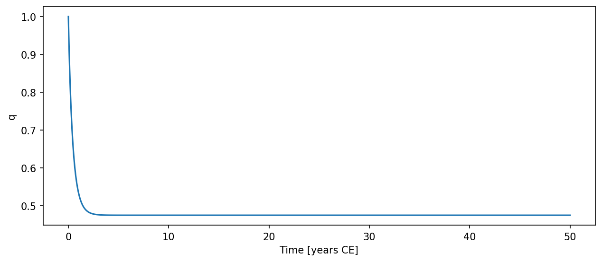

# Stommel { #climatecritters.Stommel }

```python
Stommel(
    var_name='stommel',
    alpha=1.0,
    beta=1.0,
    k=1.0,
    E=0.0,
    lambda_T=1.0,
    lambda_S=1.0,
    T_star=1.0,
    S_star=0.0,
    state_variables=None,
    diagnostic_variables=None,
    *args,
    **kwargs,
)
```

Minimal two-box Stommel thermohaline circulation model.

State variables are the pole-to-equator temperature contrast ``T`` and
salinity contrast ``S``.  The overturning strength is parameterized as:

    q = k * (alpha*T - beta*S)

and the prognostic equations are:

    dT/dt = -lambda_T * (T - T_star) - |q|*T
    dS/dt =  E - lambda_S * (S - S_star) - |q|*S

## Parameters {.doc-section .doc-section-parameters}

<code>[**var_name**]{.parameter-name} [:]{.parameter-annotation-sep} [[str](`str`)]{.parameter-annotation} [ = ]{.parameter-default-sep} [\'stommel\']{.parameter-default}</code>

:   Label for the model output.  Default ``'stommel'``.

<code>[**alpha**]{.parameter-name} [:]{.parameter-annotation-sep} [[float](`float`) or [callable](`callable`) or [cc](`cc`).[Forcing](`cc.Forcing`)]{.parameter-annotation} [ = ]{.parameter-default-sep} [1.0]{.parameter-default}</code>

:   Thermal expansion coefficient.  Default 1.0.

<code>[**beta**]{.parameter-name} [:]{.parameter-annotation-sep} [[float](`float`) or [callable](`callable`) or [cc](`cc`).[Forcing](`cc.Forcing`)]{.parameter-annotation} [ = ]{.parameter-default-sep} [1.0]{.parameter-default}</code>

:   Haline contraction coefficient.  Default 1.0.

<code>[**k**]{.parameter-name} [:]{.parameter-annotation-sep} [[float](`float`) or [callable](`callable`) or [cc](`cc`).[Forcing](`cc.Forcing`)]{.parameter-annotation} [ = ]{.parameter-default-sep} [1.0]{.parameter-default}</code>

:   Hydraulic constant controlling overturning sensitivity.  Default 1.0.

<code>[**E**]{.parameter-name} [:]{.parameter-annotation-sep} [[float](`float`) or [callable](`callable`) or [cc](`cc`).[Forcing](`cc.Forcing`)]{.parameter-annotation} [ = ]{.parameter-default-sep} [0.0]{.parameter-default}</code>

:   Net evaporation-minus-precipitation freshwater flux.  Default 0.0.

<code>[**lambda_T**]{.parameter-name} [:]{.parameter-annotation-sep} [[float](`float`) or [callable](`callable`) or [cc](`cc`).[Forcing](`cc.Forcing`)]{.parameter-annotation} [ = ]{.parameter-default-sep} [1.0]{.parameter-default}</code>

:   Thermal restoring rate.  Default 1.0.

<code>[**lambda_S**]{.parameter-name} [:]{.parameter-annotation-sep} [[float](`float`) or [callable](`callable`) or [cc](`cc`).[Forcing](`cc.Forcing`)]{.parameter-annotation} [ = ]{.parameter-default-sep} [1.0]{.parameter-default}</code>

:   Saline restoring rate.  Default 1.0.

<code>[**T_star**]{.parameter-name} [:]{.parameter-annotation-sep} [[float](`float`) or [callable](`callable`) or [cc](`cc`).[Forcing](`cc.Forcing`)]{.parameter-annotation} [ = ]{.parameter-default-sep} [1.0]{.parameter-default}</code>

:   Equilibrium temperature contrast.  Default 1.0.

<code>[**S_star**]{.parameter-name} [:]{.parameter-annotation-sep} [[float](`float`) or [callable](`callable`) or [cc](`cc`).[Forcing](`cc.Forcing`)]{.parameter-annotation} [ = ]{.parameter-default-sep} [0.0]{.parameter-default}</code>

:   Equilibrium salinity contrast.  Default 0.0.

## Notes {.doc-section .doc-section-notes}

The model uses ``uses_post_history`` to compute the overturning
diagnostic ``q`` after integration.  State variables are ``T`` and ``S``;
diagnostic variable is ``q``.

## References {.doc-section .doc-section-references}

Stommel, H. (1961). Thermohaline convection with two stable regimes of
flow. Tellus, 13(2), 224–230.

## Notes {.doc-section .doc-section-notes}

State variables are ``T`` and ``S`` (in that order).  Diagnostic
variable is ``q`` (overturning strength), computed after integration.

To drive the salinity equation with an external freshwater forcing::

    model = Stommel(E=0.0)
    model.register_forcing('S', cc.Forcing(lambda t: 0.1),
                           attachment_style='additive', timing='pre')

## Examples {.doc-section .doc-section-examples}

```python
import climatecritters as cc
from climatecritters.model_critters.stommel import Stommel
import matplotlib.pyplot as plt

model = Stommel(E=0.3, T_star=1.0, S_star=0.0)
output = model.integrate(
    t_span=(0, 50), y0=[1.0, 0.0], method='RK45'
)
ts_q = output.to_pyleo(var_names=['q'])
ts_q.plot()
plt.savefig('docs/reference/figures/Stommel_example.png',
            dpi=150, bbox_inches='tight')
```


