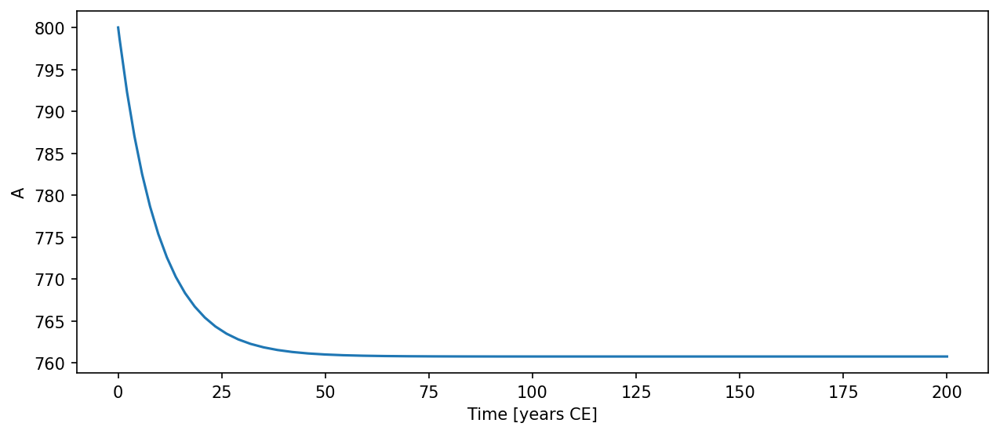

# TwoBoxCarbon { #climatecritters.TwoBoxCarbon }

```python
TwoBoxCarbon(
    var_name='two_box_carbon',
    k=0.2,
    R=0.0,
    l_s=0.0,
    V_atm=1.0,
    V_surf=1.0,
    state_variables=None,
    diagnostic_variables=None,
    *args,
    **kwargs,
)
```

Two-box carbon exchange model with explicit box volumes.

State variables ``A`` and ``S`` are carbon inventories (mass units) in the
atmospheric and surface-ocean boxes respectively.  Air-sea exchange is
driven by the concentration gradient:

    exchange = k * (A/V_atm - S/V_surf)
    dA/dt = -exchange + R - l_s*A
    dS/dt = exchange

## Parameters {.doc-section .doc-section-parameters}

<code>[**var_name**]{.parameter-name} [:]{.parameter-annotation-sep} [[str](`str`)]{.parameter-annotation} [ = ]{.parameter-default-sep} [\'two_box_carbon\']{.parameter-default}</code>

:   Label for the model output.  Default ``'two_box_carbon'``.

<code>[**k**]{.parameter-name} [:]{.parameter-annotation-sep} [[float](`float`) or [callable](`callable`) or [cc](`cc`).[Forcing](`cc.Forcing`)]{.parameter-annotation} [ = ]{.parameter-default-sep} [0.2]{.parameter-default}</code>

:   Air-sea gas exchange rate constant (volume units per time). Default 0.2.

<code>[**R**]{.parameter-name} [:]{.parameter-annotation-sep} [[float](`float`) or [callable](`callable`) or [cc](`cc`).[Forcing](`cc.Forcing`)]{.parameter-annotation} [ = ]{.parameter-default-sep} [0.0]{.parameter-default}</code>

:   Constant carbon source flux into the atmosphere (mass per time). Default 0.0.  Register a time-varying source via ``model.register_forcing('R', forcing_obj)``.

<code>[**l_s**]{.parameter-name} [:]{.parameter-annotation-sep} [[float](`float`) or [callable](`callable`) or [cc](`cc`).[Forcing](`cc.Forcing`)]{.parameter-annotation} [ = ]{.parameter-default-sep} [0.0]{.parameter-default}</code>

:   First-order atmospheric loss coefficient.  Default 0.0.

<code>[**V_atm**]{.parameter-name} [:]{.parameter-annotation-sep} [[float](`float`) or [callable](`callable`) or [cc](`cc`).[Forcing](`cc.Forcing`)]{.parameter-annotation} [ = ]{.parameter-default-sep} [1.0]{.parameter-default}</code>

:   Volume of the atmospheric box (must be > 0).  Default 1.0.

<code>[**V_surf**]{.parameter-name} [:]{.parameter-annotation-sep} [[float](`float`) or [callable](`callable`) or [cc](`cc`).[Forcing](`cc.Forcing`)]{.parameter-annotation} [ = ]{.parameter-default-sep} [1.0]{.parameter-default}</code>

:   Volume of the surface-ocean box (must be > 0).  Default 1.0.

## Notes {.doc-section .doc-section-notes}

Diagnostic variable ``net_flux`` (the atmospheric tendency ``dA/dt``)
is computed in ``populate_diagnostics_from_history`` after integration.

``V_atm`` and ``V_surf`` must be positive; ``ValueError`` is raised if
either is ≤ 0.

## Examples {.doc-section .doc-section-examples}

```python
import climatecritters as cc
from climatecritters.model_critters.two_box_carbon import TwoBoxCarbon
import matplotlib.pyplot as plt

model = TwoBoxCarbon(k=0.1, V_atm=1.0, V_surf=50.0)
output = model.integrate(
    t_span=(0, 200), y0=[800.0, 38000.0], method='RK45'
)
ts = output.to_pyleo(var_names=['A'])
ts.plot()
plt.savefig('docs/reference/figures/TwoBoxCarbon_example.png',
            dpi=150, bbox_inches='tight')
```


