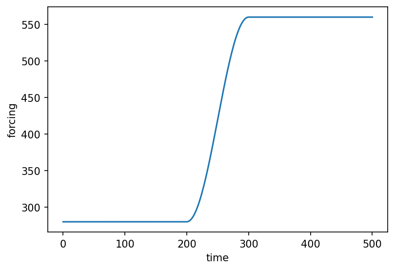
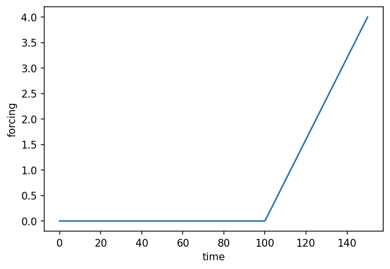

# core.Forcing { #climatecritters.core.Forcing }

```python
core.Forcing(
    data,
    time=None,
    params=None,
    interpolation='cubic',
    plot_kwargs=None,
)
```

Unified time-varying signal consumed by models.

`Forcing` wraps any time-dependent input and exposes a single
``get_forcing(t)`` interface to the model.

## Input types {.doc-section .doc-section-input-types}

Pass a callable, a data array, a bundled CSV dataset, or a compiled
`ForcingSequence`::

    # callable
    f = cc.Forcing(lambda t: 1360.0 + 5.0 * np.sin(2 * np.pi * t / 11.0))

    # data array
    f = cc.Forcing(data=values, time=t_axis, interpolation='cubic')

    # bundled CSV dataset
    f = cc.Forcing.from_csv(dataset='vieira_tsi')
    f = cc.Forcing.from_csv(file_path='my_data.csv', time_name='age', value_name='co2')

    # ForcingSequence (auto-compiled)
    seq = cc.forcing.Hold(100, value=0.0) + cc.forcing.Ramp(50, y0=0.0, yf=4.0)
    f   = cc.Forcing(seq)

## Value superposition {.doc-section .doc-section-value-superposition}

Two `Forcing` objects (or a `Forcing` and a callable) can be combined
with ``+`` to produce a new `Forcing` whose value is the pointwise sum::

    combined = cc.Forcing(orbital_func) + cc.Forcing(noise_func)

A bounded `ForcingElement` or `ForcingSequence` can also be superposed;
it is auto-compiled and the result is bounded to that element's duration.

Full operator table:

| Left | Right | Result | Semantic |
|---|---|---|---|
| `Forcing` | `Forcing` | `Forcing` (indefinite) | value superposition for all t |
| `Forcing` | callable | `Forcing` (indefinite) | value superposition for all t |
| `ForcingElement` | `ForcingElement` | `ForcingSequence` | temporal concatenation |
| `ForcingSequence` | `ForcingElement` / `ForcingSequence` | `ForcingSequence` | temporal concatenation |
| `ForcingElement` / `ForcingSequence` | `Forcing` | `Forcing` (bounded) | additive overlay; auto-compiles |
| `Forcing` | `ForcingElement` / `ForcingSequence` | `Forcing` (bounded) | additive overlay; auto-compiles |

## Parameters {.doc-section .doc-section-parameters}

<code>[**data**]{.parameter-name} [:]{.parameter-annotation-sep} [callable, array-like, or ForcingSequence]{.parameter-annotation}</code>

:   The signal source.  See *Input types* above.

<code>[**time**]{.parameter-name} [:]{.parameter-annotation-sep} [[array](`array`) - [like](`like`)]{.parameter-annotation} [ = ]{.parameter-default-sep} [None]{.parameter-default}</code>

:   Time axis for array-backed `Forcing`.  Must be strictly increasing and the same length as ``data``.  If omitted, integer indices are used.

<code>[**params**]{.parameter-name} [:]{.parameter-annotation-sep} [[dict](`dict`)]{.parameter-annotation} [ = ]{.parameter-default-sep} [None]{.parameter-default}</code>

:   Extra keyword arguments forwarded to a callable ``data`` via ``functools.partial``.

<code>[**interpolation**]{.parameter-name} [:]{.parameter-annotation-sep} [(\'cubic\', \'linear\')]{.parameter-annotation} [ = ]{.parameter-default-sep} [\'cubic\']{.parameter-default}</code>

:   Interpolation method for array-backed `Forcing`.  Default ``'cubic'``.

<code>[**plot_kwargs**]{.parameter-name} [:]{.parameter-annotation-sep} [[dict](`dict`)]{.parameter-annotation} [ = ]{.parameter-default-sep} [None]{.parameter-default}</code>

:   Matplotlib keyword arguments used by `.plot()` — e.g. ``color``, ``linewidth``, ``label``, ``linestyle``.  Explicit kwargs passed to `.plot()` override these defaults.

## Examples {.doc-section .doc-section-examples}

```python
import matplotlib.pyplot as plt
import climatecritters as cc

scenario = (
    cc.forcing.Hold(200, value=280.0)
    + cc.forcing.Ramp(100, y0=280.0, yf=560.0, shape='cosine')
    + cc.forcing.Hold(200, value=560.0)
)
fig, ax = scenario.compile().plot()
plt.savefig('docs/reference/figures/Forcing_sequence_example.png',
            dpi=150, bbox_inches='tight')
```




## Methods

| Name | Description |
| --- | --- |
| [from_csv](#climatecritters.core.Forcing.from_csv) | Build a `Forcing` from a CSV file or a bundled dataset. |
| [from_sequence](#climatecritters.core.Forcing.from_sequence) | Build a `Forcing` from an iterable of `ForcingElement` parts. |
| [get_forcing](#climatecritters.core.Forcing.get_forcing) | Return the forcing value at time ``t``. |
| [plot](#climatecritters.core.Forcing.plot) | Plot the forcing signal over a time range. |

### from_csv { #climatecritters.core.Forcing.from_csv }

```python
core.Forcing.from_csv(
    dataset=None,
    file_path=None,
    value_name=None,
    time_name=None,
    params=None,
    interpolation='cubic',
)
```

Build a `Forcing` from a CSV file or a bundled dataset.

Two datasets are included with ClimateCritters:

* ``'vieira_tsi'`` — Vieira et al. total solar irradiance reconstruction
* ``'insolation'`` — 65°N summer solstice insolation (Laskar et al.)

#### Parameters {.doc-section .doc-section-parameters}

<code>[**dataset**]{.parameter-name} [:]{.parameter-annotation-sep} [(\'vieira_tsi\', \'insolation\')]{.parameter-annotation} [ = ]{.parameter-default-sep} [\'vieira_tsi\']{.parameter-default}</code>

:   Name of a bundled dataset.  Mutually exclusive with ``file_path``.

<code>[**file_path**]{.parameter-name} [:]{.parameter-annotation-sep} [[str](`str`) or [Path](`pathlib.Path`)]{.parameter-annotation} [ = ]{.parameter-default-sep} [None]{.parameter-default}</code>

:   Path to an arbitrary CSV file.  Mutually exclusive with ``dataset``.

<code>[**value_name**]{.parameter-name} [:]{.parameter-annotation-sep} [[str](`str`)]{.parameter-annotation} [ = ]{.parameter-default-sep} [None]{.parameter-default}</code>

:   Column name for the forcing values.  If omitted, the first column (or the dataset default) is used.

<code>[**time_name**]{.parameter-name} [:]{.parameter-annotation-sep} [[str](`str`)]{.parameter-annotation} [ = ]{.parameter-default-sep} [None]{.parameter-default}</code>

:   Column name for the time axis.  If omitted, integer indices are used (or the dataset default is applied).

<code>[**params**]{.parameter-name} [:]{.parameter-annotation-sep} [[dict](`dict`)]{.parameter-annotation} [ = ]{.parameter-default-sep} [None]{.parameter-default}</code>

:   Extra keyword arguments forwarded to the interpolator.

<code>[**interpolation**]{.parameter-name} [:]{.parameter-annotation-sep} [(\'cubic\', \'linear\')]{.parameter-annotation} [ = ]{.parameter-default-sep} [\'cubic\']{.parameter-default}</code>

:   Interpolation method.  Default ``'cubic'``.

#### Returns {.doc-section .doc-section-returns}

<code>[**forcing**]{.parameter-name} [:]{.parameter-annotation-sep} [[Forcing](`climatecritters.core.forcing.Forcing`)]{.parameter-annotation}</code>

:   

#### Examples {.doc-section .doc-section-examples}

```python
import climatecritters as cc

# Bundled dataset
tsi = cc.Forcing.from_csv(dataset='vieira_tsi')

# Custom CSV
co2 = cc.Forcing.from_csv(
    file_path='data/co2_record.csv',
    time_name='age_kyr',
    value_name='co2_ppm',
    interpolation='linear',
)
```

### from_sequence { #climatecritters.core.Forcing.from_sequence }

```python
core.Forcing.from_sequence(parts, label='forcing')
```

Build a `Forcing` from an iterable of `ForcingElement` parts.

Convenience alias for ``ForcingSequence(parts, label).compile()``.

#### Parameters {.doc-section .doc-section-parameters}

<code>[**parts**]{.parameter-name} [:]{.parameter-annotation-sep} [iterable of ForcingElement]{.parameter-annotation}</code>

:   Ordered `Hold`, `Ramp`, `Harmonic`, or general `ForcingElement` instances defining the piecewise timeline.

<code>[**label**]{.parameter-name} [:]{.parameter-annotation-sep} [[str](`str`)]{.parameter-annotation} [ = ]{.parameter-default-sep} [\'forcing\']{.parameter-default}</code>

:   Human-readable label for the resulting forcing object.

#### Returns {.doc-section .doc-section-returns}

<code>[**forcing**]{.parameter-name} [:]{.parameter-annotation-sep} [[Forcing](`climatecritters.core.forcing.Forcing`)]{.parameter-annotation}</code>

:   

#### Examples {.doc-section .doc-section-examples}

```python
import climatecritters as cc

f = cc.Forcing.from_sequence([
    cc.forcing.Hold(duration=100, value=0.0),
    cc.forcing.Ramp(duration=50, y0=0.0, yf=1.0, shape='cosine'),
    cc.forcing.Hold(duration=100, value=1.0),
], label='freshwater_hosing')
```

### get_forcing { #climatecritters.core.Forcing.get_forcing }

```python
core.Forcing.get_forcing(t)
```

Return the forcing value at time ``t``.

#### Parameters {.doc-section .doc-section-parameters}

<code>[**t**]{.parameter-name} [:]{.parameter-annotation-sep} [[float](`float`) or [array](`array`) - [like](`like`)]{.parameter-annotation}</code>

:   Time value(s).  Accepts scalars or NumPy arrays; returns the same shape.

#### Returns {.doc-section .doc-section-returns}

<code>[]{.parameter-name} [:]{.parameter-annotation-sep} [[float](`float`) or [ndarray](`ndarray`)]{.parameter-annotation}</code>

:   

### plot { #climatecritters.core.Forcing.plot }

```python
core.Forcing.plot(t_span=None, n=300, ax=None, **kwargs)
```

Plot the forcing signal over a time range.

#### Parameters {.doc-section .doc-section-parameters}

<code>[**t_span**]{.parameter-name} [:]{.parameter-annotation-sep} [([float](`float`), [float](`float`))]{.parameter-annotation} [ = ]{.parameter-default-sep} [None]{.parameter-default}</code>

:   Time range ``(t0, tf)`` to evaluate and plot.  For sequence-backed ``Forcing`` objects this defaults to ``(0, summary["t_end"])``.  For array-backed objects it defaults to ``(time[0], time[-1])``.  For callable-backed objects ``t_span`` is **required**.

<code>[**n**]{.parameter-name} [:]{.parameter-annotation-sep} [[int](`int`)]{.parameter-annotation} [ = ]{.parameter-default-sep} [300]{.parameter-default}</code>

:   Number of evaluation points.  Default 300.

<code>[**ax**]{.parameter-name} [:]{.parameter-annotation-sep} [[matplotlib](`matplotlib`).[axes](`matplotlib.axes`).[Axes](`matplotlib.axes.Axes`)]{.parameter-annotation} [ = ]{.parameter-default-sep} [None]{.parameter-default}</code>

:   Axes to plot into.  A new figure is created if ``None``.

<code>[****kwargs**]{.parameter-name} [:]{.parameter-annotation-sep} []{.parameter-annotation} [ = ]{.parameter-default-sep} [{}]{.parameter-default}</code>

:   Additional keyword arguments forwarded to ``ax.plot`` (e.g. ``color``, ``linewidth``, ``label``).

#### Returns {.doc-section .doc-section-returns}

<code>[**fig**]{.parameter-name} [:]{.parameter-annotation-sep} [[matplotlib](`matplotlib`).[figure](`matplotlib.figure`).[Figure](`matplotlib.figure.Figure`)]{.parameter-annotation}</code>

:   

<code>[**ax**]{.parameter-name} [:]{.parameter-annotation-sep} [[matplotlib](`matplotlib`).[axes](`matplotlib.axes`).[Axes](`matplotlib.axes.Axes`)]{.parameter-annotation}</code>

:   

#### Raises {.doc-section .doc-section-raises}

<code>[:]{.parameter-annotation-sep} [[ValueError](`ValueError`)]{.parameter-annotation}</code>

:   If ``t_span`` is not provided for a callable-backed ``Forcing`` that has no time axis.

#### Examples {.doc-section .doc-section-examples}

```python
import numpy as np
import matplotlib.pyplot as plt
import climatecritters as cc

# Sequence-backed — t_span inferred automatically
f = cc.Forcing.from_sequence([
    cc.forcing.Hold(100, value=0.0),
    cc.forcing.Ramp(50, y0=0.0, yf=4.0),
])
fig, ax = f.plot()
plt.savefig('docs/reference/figures/Forcing_plot_example.png',
            dpi=150, bbox_inches='tight')

# Callable-backed — t_span required
solar = cc.Forcing(lambda t: 1360.0 + 5.0 * np.sin(t))
fig, ax = solar.plot(t_span=(0, 50))
plt.savefig('docs/reference/figures/Forcing_plot_callable_example.png',
            dpi=150, bbox_inches='tight')
```


