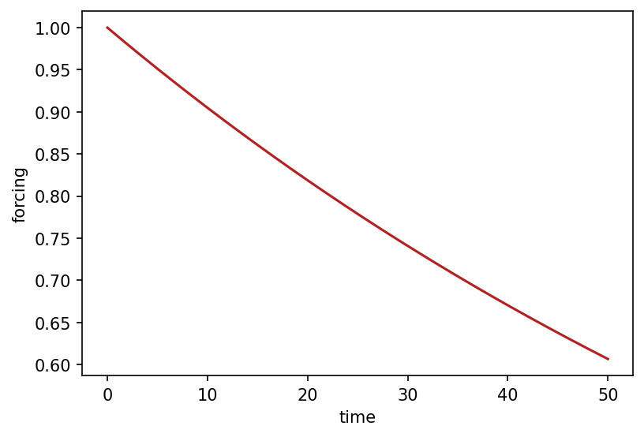

# core.forcing.ForcingElement { #climatecritters.core.forcing.ForcingElement }

```python
core.forcing.ForcingElement(func=None, duration=None, plot_kwargs=None)
```

A bounded forcing segment backed by an arbitrary callable.

``ForcingElement`` serves two roles:

1. **Base class** for the named segment types ``Hold``, ``Ramp``,
   and ``Harmonic``.  Those subclasses call ``super().__init__`` to
   inherit ``plot_kwargs``.
2. **Concrete class** for the general case — wrap *any* callable as a
   bounded segment with a fixed duration

       elem = ForcingElement(lambda t: np.sin(t), duration=10.0)

## Parameters {.doc-section .doc-section-parameters}

<code>[**func**]{.parameter-name} [:]{.parameter-annotation-sep} [[callable](`callable`)]{.parameter-annotation} [ = ]{.parameter-default-sep} [None]{.parameter-default}</code>

:   Function `f(t) -> float \| ndarray`.  Receives the *absolute* time value (``t0 + tau``) at each evaluation point.

<code>[**duration**]{.parameter-name} [:]{.parameter-annotation-sep} [[float](`float`)]{.parameter-annotation} [ = ]{.parameter-default-sep} [None]{.parameter-default}</code>

:   Length of the segment in model time units.  Must be > 0.

<code>[**plot_kwargs**]{.parameter-name} [:]{.parameter-annotation-sep} [[dict](`dict`)]{.parameter-annotation} [ = ]{.parameter-default-sep} [None]{.parameter-default}</code>

:   Matplotlib keyword arguments used when this element is drawn by ``.plot()`` or ``ForcingSequence.plot``.  Common keys: ``color``, ``linewidth``, ``linestyle``, ``label``, ``alpha``. If ``None`` (default), a colour is chosen automatically by segment kind.

## Notes {.doc-section .doc-section-notes}

A `ForcingElement` is not callable and cannot be used directly as a
model input.  Compose it into a `ForcingSequence` and call
`ForcingSequence.compile`

    seq = Hold(5, value=0.0) + elem + Hold(5, value=0.0)
    f   = seq.compile()   # → Forcing, ready to register

**Operator ``+``**

The behaviour of ``+`` depends on the type of the right-hand operand:

* ``ForcingElement + ForcingElement`` → `ForcingSequence`
  (temporal concatenation)
* ``ForcingElement + ForcingSequence`` → `ForcingSequence`
  (prepend to sequence)
* ``ForcingElement + Forcing`` → `Forcing`
  (additive overlay for the duration of the element; auto-compiles)
* ``Forcing + ForcingElement`` → `Forcing`
  (same; ``__radd__`` makes this commutative)

## Examples {.doc-section .doc-section-examples}

```python
import numpy as np
import matplotlib.pyplot as plt
import climatecritters as cc

elem = cc.forcing.ForcingElement(lambda t: np.exp(-0.01 * t), duration=50.0)
fig, ax = elem.plot()
plt.savefig('docs/reference/figures/ForcingElement_example.png',
            dpi=150, bbox_inches='tight')
```




## Methods

| Name | Description |
| --- | --- |
| [plot](#climatecritters.core.forcing.ForcingElement.plot) | Plot this element over its duration. |

### plot { #climatecritters.core.forcing.ForcingElement.plot }

```python
core.forcing.ForcingElement.plot(t_span=None, n=300, ax=None, **kwargs)
```

Plot this element over its duration.

Delegates to `ForcingSequence.plot` with this element as the
only part.  ``t_span`` defaults to ``(0, duration)``.

#### Parameters {.doc-section .doc-section-parameters}

<code>[**t_span**]{.parameter-name} [:]{.parameter-annotation-sep} [([float](`float`), [float](`float`))]{.parameter-annotation} [ = ]{.parameter-default-sep} [None]{.parameter-default}</code>

:   Time range to plot.  Defaults to ``(0, duration)``.

<code>[**n**]{.parameter-name} [:]{.parameter-annotation-sep} [[int](`int`)]{.parameter-annotation} [ = ]{.parameter-default-sep} [300]{.parameter-default}</code>

:   Number of evaluation points.  Default 300.

<code>[**ax**]{.parameter-name} [:]{.parameter-annotation-sep} [[matplotlib](`matplotlib`).[axes](`matplotlib.axes`).[Axes](`matplotlib.axes.Axes`)]{.parameter-annotation} [ = ]{.parameter-default-sep} [None]{.parameter-default}</code>

:   Axes to plot into.  A new figure is created if ``None``.

<code>[****kwargs**]{.parameter-name} [:]{.parameter-annotation-sep} []{.parameter-annotation} [ = ]{.parameter-default-sep} [{}]{.parameter-default}</code>

:   Additional keyword arguments passed to ``ax.plot``, overriding any ``plot_kwargs`` set on this element.

#### Returns {.doc-section .doc-section-returns}

<code>[]{.parameter-name} [:]{.parameter-annotation-sep} [fig, ax : matplotlib Figure and Axes]{.parameter-annotation}</code>

:   