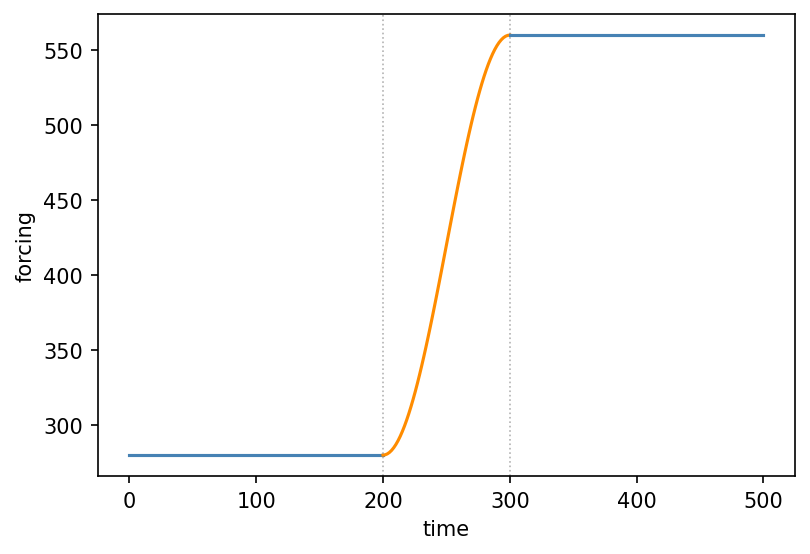
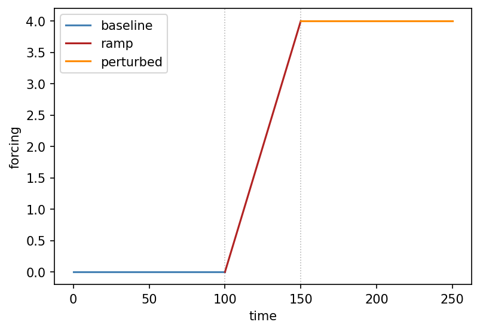

# core.forcing.ForcingSequence { #climatecritters.core.forcing.ForcingSequence }

```python
core.forcing.ForcingSequence(parts=None, label='forcing')
```

Composable sequence of `ForcingElement` parts.

``ForcingSequence`` is a **builder** — it assembles an ordered timeline
of segments and knows how to resolve them.  It is **not callable** and
cannot be used directly as a model input.  Call `compile` to produce
a `Forcing` that is callable and ready to register::

    seq = Hold(100, value=0.0) + Ramp(50, y0=0.0, yf=4.0) + Hold(100, value=0.0)
    f   = seq.compile()
    model.register_forcing('S', f, attachment_style='additive', timing='pre')

## Parameters {.doc-section .doc-section-parameters}

<code>[**parts**]{.parameter-name} [:]{.parameter-annotation-sep} [list of ForcingElement]{.parameter-annotation} [ = ]{.parameter-default-sep} [None]{.parameter-default}</code>

:   Initial list of elements.  May also be built incrementally with ``+``.

<code>[**label**]{.parameter-name} [:]{.parameter-annotation-sep} [[str](`str`)]{.parameter-annotation} [ = ]{.parameter-default-sep} [\'forcing\']{.parameter-default}</code>

:   Human-readable label carried through to the compiled `Forcing`. Default ``'forcing'``.

## Notes {.doc-section .doc-section-notes}

**Operator ``+``**

* ``ForcingSequence + ForcingElement`` → `ForcingSequence`
  (append element)
* ``ForcingSequence + ForcingSequence`` → `ForcingSequence`
  (concatenate)
* ``ForcingSequence + Forcing`` → `Forcing`
  (additive overlay for the full duration of the sequence; auto-compiles)
* ``Forcing + ForcingSequence`` → `Forcing`
  (same; ``__radd__`` makes this commutative)

**No memoization** — `compile` always produces a fresh
`Forcing`.  Recompile freely after modifying ``parts``.

**Visualisation** — call `plot` to inspect the scenario before
registering it.  Each segment is colour-coded by type and labelled from
its ``plot_kwargs`` if provided.

## Examples {.doc-section .doc-section-examples}

```python
import matplotlib.pyplot as plt
import climatecritters as cc

scenario = (
    cc.forcing.Hold(200, value=280.0)
    + cc.forcing.Ramp(100, y0=280.0, yf=560.0, shape='cosine')
    + cc.forcing.Hold(200, value=560.0)
)
fig, ax = scenario.plot()
plt.savefig('docs/reference/figures/ForcingSequence_example.png',
            dpi=150, bbox_inches='tight')
```




## Methods

| Name | Description |
| --- | --- |
| [compile](#climatecritters.core.forcing.ForcingSequence.compile) | Resolve all elements and return a callable `Forcing`. |
| [plot](#climatecritters.core.forcing.ForcingSequence.plot) | Plot the sequence, colour-coded by segment type. |

### compile { #climatecritters.core.forcing.ForcingSequence.compile }

```python
core.forcing.ForcingSequence.compile()
```

Resolve all elements and return a callable `Forcing`.

Each call produces a **fresh** `Forcing` with no internal
caching.  The sequence itself is unchanged and can be extended and
recompiled freely::

    seq = Hold(50, value=0.0) + Ramp(100, y0=0.0, yf=4.0)
    f1  = seq.compile()
    seq = seq + Hold(50, value=4.0)
    f2  = seq.compile()   # f1 is unaffected

#### Returns {.doc-section .doc-section-returns}

<code>[**forcing**]{.parameter-name} [:]{.parameter-annotation-sep} [[Forcing](`climatecritters.core.forcing.Forcing`)]{.parameter-annotation}</code>

:   A bounded `Forcing` defined over ``[0, t_end]``.  Outside this interval the value is held at the first / last segment's boundary value.

#### Raises {.doc-section .doc-section-raises}

<code>[:]{.parameter-annotation-sep} [[ValueError](`ValueError`)]{.parameter-annotation}</code>

:   If the sequence has no parts.

<code>[:]{.parameter-annotation-sep} [[TypeError](`TypeError`)]{.parameter-annotation}</code>

:   If any part is not a `ForcingElement`.

### plot { #climatecritters.core.forcing.ForcingSequence.plot }

```python
core.forcing.ForcingSequence.plot(t_span=None, n=300, ax=None, **kwargs)
```

Plot the sequence, colour-coded by segment type.

Each segment is drawn separately using its own ``plot_kwargs`` if set,
otherwise a default colour is chosen by segment kind (``Hold`` →
blue, ``Ramp`` → orange, ``Harmonic`` → green, callable → red).
Vertical dotted lines mark the transitions between segments.

#### Parameters {.doc-section .doc-section-parameters}

<code>[**t_span**]{.parameter-name} [:]{.parameter-annotation-sep} [([float](`float`), [float](`float`))]{.parameter-annotation} [ = ]{.parameter-default-sep} [None]{.parameter-default}</code>

:   Time range to plot.  Defaults to ``(0, t_end)`` of the compiled sequence.

<code>[**n**]{.parameter-name} [:]{.parameter-annotation-sep} [[int](`int`)]{.parameter-annotation} [ = ]{.parameter-default-sep} [300]{.parameter-default}</code>

:   Total number of evaluation points distributed proportionally across segments.  Default 300.

<code>[**ax**]{.parameter-name} [:]{.parameter-annotation-sep} [[matplotlib](`matplotlib`).[axes](`matplotlib.axes`).[Axes](`matplotlib.axes.Axes`)]{.parameter-annotation} [ = ]{.parameter-default-sep} [None]{.parameter-default}</code>

:   Axes to plot into.  A new figure is created if ``None``.

<code>[****kwargs**]{.parameter-name} [:]{.parameter-annotation-sep} []{.parameter-annotation} [ = ]{.parameter-default-sep} [{}]{.parameter-default}</code>

:   Additional keyword arguments applied to **all** segments, overriding per-element ``plot_kwargs``.  Useful for e.g. ``linewidth`` or ``alpha``.

#### Returns {.doc-section .doc-section-returns}

<code>[**fig**]{.parameter-name} [:]{.parameter-annotation-sep} [[matplotlib](`matplotlib`).[figure](`matplotlib.figure`).[Figure](`matplotlib.figure.Figure`)]{.parameter-annotation}</code>

:   

<code>[**ax**]{.parameter-name} [:]{.parameter-annotation-sep} [[matplotlib](`matplotlib`).[axes](`matplotlib.axes`).[Axes](`matplotlib.axes.Axes`)]{.parameter-annotation}</code>

:   

#### Examples {.doc-section .doc-section-examples}

```python
import matplotlib.pyplot as plt
import climatecritters as cc

scenario = (
    cc.forcing.Hold(100, value=0.0, plot_kwargs={'color': 'steelblue', 'label': 'baseline'})
    + cc.forcing.Ramp(50, y0=0.0, yf=4.0, plot_kwargs={'color': 'firebrick', 'label': 'ramp'})
    + cc.forcing.Hold(100, value=4.0, plot_kwargs={'color': 'darkorange', 'label': 'perturbed'})
)
fig, ax = scenario.plot()
ax.set_xlabel('time'); ax.set_ylabel('forcing'); ax.legend()
plt.savefig('docs/reference/figures/ForcingSequence_plot_example.png',
            dpi=150, bbox_inches='tight')
```


