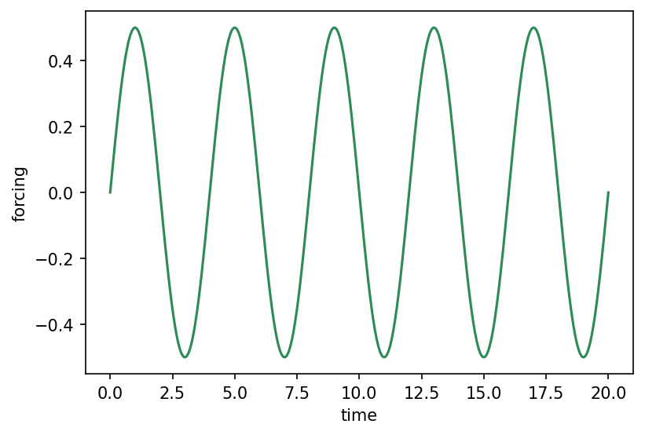

# core.forcing.Harmonic { #climatecritters.core.forcing.Harmonic }

```python
core.forcing.Harmonic(
    duration,
    period,
    A,
    center=None,
    y0=None,
    plot_kwargs=None,
)
```

Sinusoidal segment with automatic phase continuity.

The phase at the start of the segment is computed so that the sinusoid
passes through ``y0`` (or the previous segment's endpoint), ensuring a
smooth join when embedded in a `ForcingSequence`.

## Parameters {.doc-section .doc-section-parameters}

<code>[**duration**]{.parameter-name} [:]{.parameter-annotation-sep} [[float](`float`)]{.parameter-annotation}</code>

:   Length of the segment.  Must be > 0.

<code>[**period**]{.parameter-name} [:]{.parameter-annotation-sep} [[float](`float`)]{.parameter-annotation}</code>

:   Period of the sinusoid in model time units.  Must be > 0.

<code>[**A**]{.parameter-name} [:]{.parameter-annotation-sep} [[float](`float`)]{.parameter-annotation}</code>

:   Amplitude.  Must be non-zero.

<code>[**center**]{.parameter-name} [:]{.parameter-annotation-sep} [[float](`float`)]{.parameter-annotation} [ = ]{.parameter-default-sep} [None]{.parameter-default}</code>

:   Mean value (vertical offset) of the sinusoid.  If omitted, the mean is inferred from ``y0`` such that the sinusoid oscillates symmetrically about the starting value.

<code>[**y0**]{.parameter-name} [:]{.parameter-annotation-sep} [[float](`float`)]{.parameter-annotation} [ = ]{.parameter-default-sep} [None]{.parameter-default}</code>

:   Starting value.  If omitted, inherits from the previous segment's endpoint.  At least one of ``y0`` or ``center`` must be provided (or a previous segment must exist).

## Examples {.doc-section .doc-section-examples}

```python
import matplotlib.pyplot as plt
import climatecritters as cc

h = cc.forcing.Harmonic(duration=20, period=4.0, A=0.5, center=0.0)
fig, ax = h.plot()
plt.savefig('docs/reference/figures/Harmonic_example.png',
            dpi=150, bbox_inches='tight')
```


