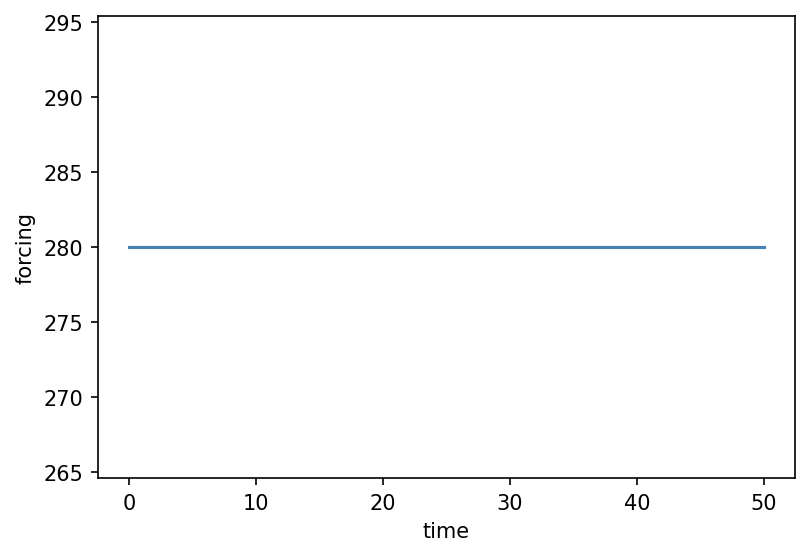

# core.forcing.Hold { #climatecritters.core.forcing.Hold }

```python
core.forcing.Hold(dt=None, value=None, duration=None, tf=None, plot_kwargs=None)
```

Constant-valued segment.

## Parameters {.doc-section .doc-section-parameters}

<code>[**value**]{.parameter-name} [:]{.parameter-annotation-sep} [[float](`float`)]{.parameter-annotation} [ = ]{.parameter-default-sep} [None]{.parameter-default}</code>

:   The constant forcing value throughout the segment.

<code>[**duration**]{.parameter-name} [:]{.parameter-annotation-sep} [[float](`float`)]{.parameter-annotation} [ = ]{.parameter-default-sep} [None]{.parameter-default}</code>

:   Length of the segment.  Alias: ``dt``.  Exactly one of ``duration``, ``dt``, or ``tf`` must be provided.

<code>[**dt**]{.parameter-name} [:]{.parameter-annotation-sep} [[float](`float`)]{.parameter-annotation} [ = ]{.parameter-default-sep} [None]{.parameter-default}</code>

:   Alias for ``duration``.

<code>[**tf**]{.parameter-name} [:]{.parameter-annotation-sep} [[float](`float`)]{.parameter-annotation} [ = ]{.parameter-default-sep} [None]{.parameter-default}</code>

:   Absolute end time (used instead of ``duration`` when the end time is known but the start time is not yet fixed).

## Examples {.doc-section .doc-section-examples}

```python
import matplotlib.pyplot as plt
import climatecritters as cc

h = cc.forcing.Hold(duration=50, value=280.0)
fig, ax = h.plot()
plt.savefig('docs/reference/figures/Hold_example.png',
            dpi=150, bbox_inches='tight')
```


