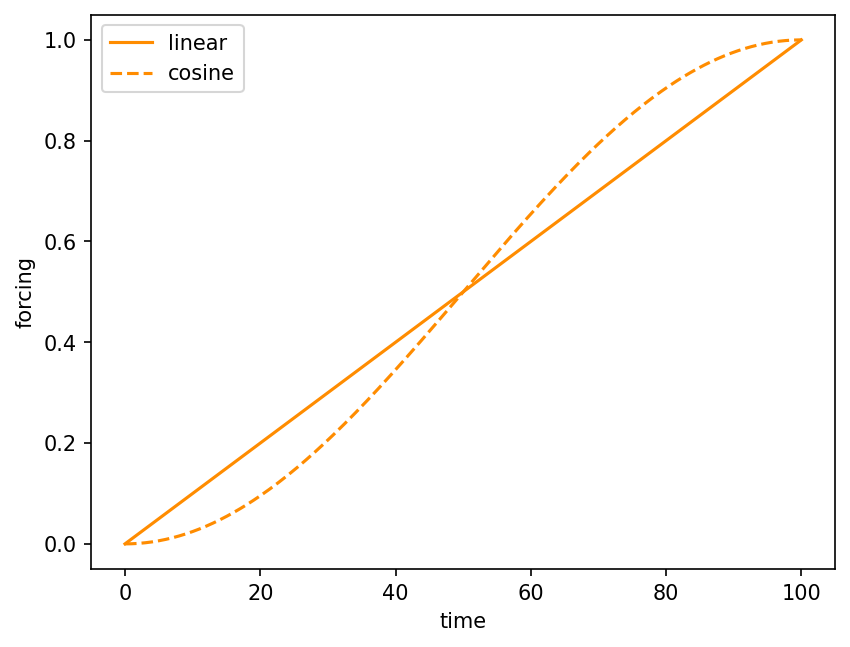

# core.forcing.Ramp { #climatecritters.core.forcing.Ramp }

```python
core.forcing.Ramp(
    duration=None,
    y0=None,
    yf=None,
    A=None,
    y_exit=None,
    shape='linear',
    plot_kwargs=None,
)
```

Monotonic transition between two values with linear or cosine easing.

## Parameters {.doc-section .doc-section-parameters}

<code>[**duration**]{.parameter-name} [:]{.parameter-annotation-sep} [[float](`float`)]{.parameter-annotation} [ = ]{.parameter-default-sep} [None]{.parameter-default}</code>

:   Length of the transition.

<code>[**y0**]{.parameter-name} [:]{.parameter-annotation-sep} [[float](`float`)]{.parameter-annotation} [ = ]{.parameter-default-sep} [None]{.parameter-default}</code>

:   Starting value.  If omitted, inherits from the previous segment's endpoint.

<code>[**yf**]{.parameter-name} [:]{.parameter-annotation-sep} [[float](`float`)]{.parameter-annotation} [ = ]{.parameter-default-sep} [None]{.parameter-default}</code>

:   Ending value.  If omitted, computed from ``A`` or ``y_exit``.

<code>[**A**]{.parameter-name} [:]{.parameter-annotation-sep} [[float](`float`)]{.parameter-annotation} [ = ]{.parameter-default-sep} [None]{.parameter-default}</code>

:   Signed amplitude of the transition (``yf = y0 + A``).  Used when ``yf`` is not specified directly.

<code>[**y_exit**]{.parameter-name} [:]{.parameter-annotation-sep} [[float](`float`)]{.parameter-annotation} [ = ]{.parameter-default-sep} [None]{.parameter-default}</code>

:   Absolute target value combined with ``A`` and ``duration`` to compute a proportionally scaled duration.

<code>[**shape**]{.parameter-name} [:]{.parameter-annotation-sep} [(\'linear\', \'cosine\')]{.parameter-annotation} [ = ]{.parameter-default-sep} [\'linear\']{.parameter-default}</code>

:   Interpolation shape.  ``'cosine'`` gives a smooth S-curve (eased start and end); ``'linear'`` is a straight line.  Default ``'linear'``.

## Notes {.doc-section .doc-section-notes}

The ``shape='cosine'`` option applies a half-cosine ease, producing an
S-curve::

    y(τ) = y0 + (yf - y0) * 0.5 * (1 - cos(π * τ / duration))

This is smoother than ``'linear'`` at both endpoints and is a good
choice when the transition is intended to represent a gradual forcing
change rather than an abrupt one.

## Examples {.doc-section .doc-section-examples}

```python
import matplotlib.pyplot as plt
import climatecritters as cc

fig, ax = plt.subplots()
cc.forcing.Ramp(100, y0=0.0, yf=1.0, shape='linear').plot(ax=ax, label='linear')
cc.forcing.Ramp(100, y0=0.0, yf=1.0, shape='cosine').plot(ax=ax, label='cosine', linestyle='--')
ax.legend()
plt.savefig('docs/reference/figures/Ramp_shapes_example.png',
            dpi=150, bbox_inches='tight')
```


