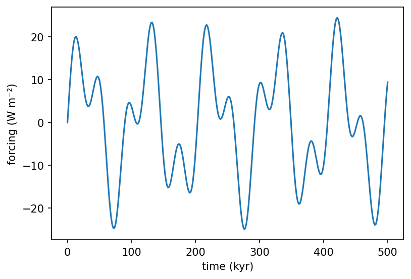

# utils.forcing.create_periodic_forcing { #climatecritters.utils.forcing.create_periodic_forcing }

```python
utils.forcing.create_periodic_forcing(
    periods_powers,
    desired_amplitude=1,
    y0=0,
    duration=None,
)
```

Build a composite periodic forcing from normalised sine components.

Component amplitudes are rescaled so their summed peak amplitude equals
``desired_amplitude``.

## Parameters {.doc-section .doc-section-parameters}

<code>[**periods_powers**]{.parameter-name} [:]{.parameter-annotation-sep} [sequence of (float, float)]{.parameter-annotation}</code>

:   Sequence of ``(period, power)`` pairs.  Each ``period`` must be > 0. ``power`` sets the relative weight of that component.

<code>[**desired_amplitude**]{.parameter-name} [:]{.parameter-annotation-sep} [[float](`float`)]{.parameter-annotation} [ = ]{.parameter-default-sep} [1]{.parameter-default}</code>

:   Peak amplitude of the composite signal.  Default 1.

<code>[**y0**]{.parameter-name} [:]{.parameter-annotation-sep} [[float](`float`)]{.parameter-annotation} [ = ]{.parameter-default-sep} [0]{.parameter-default}</code>

:   Constant offset.  Default 0.

<code>[**duration**]{.parameter-name} [:]{.parameter-annotation-sep} [[float](`float`)]{.parameter-annotation} [ = ]{.parameter-default-sep} [None]{.parameter-default}</code>

:   If given, returns a :class:`~climatecritters.core.ForcingElement`. If omitted, returns an indefinite :class:`~climatecritters.core.Forcing`.

## Returns {.doc-section .doc-section-returns}

<code>[]{.parameter-name} [:]{.parameter-annotation-sep} [[Forcing](`climatecritters.core.forcing.Forcing`) or [ForcingElement](`climatecritters.core.forcing.ForcingElement`)]{.parameter-annotation}</code>

:   

## Examples {.doc-section .doc-section-examples}

```python
import matplotlib.pyplot as plt
from climatecritters.utils.forcing import create_periodic_forcing

# Milankovitch-like: 100 kyr eccentricity + 41 kyr obliquity
orbital = create_periodic_forcing([(100, 0.6), (41, 0.4)], desired_amplitude=25.0)
fig, ax = orbital.plot(t_span=(0, 500))
ax.set_xlabel('time (kyr)'); ax.set_ylabel('forcing (W m⁻²)')
plt.savefig('docs/reference/figures/create_periodic_forcing_example.png',
            dpi=150, bbox_inches='tight')
```


