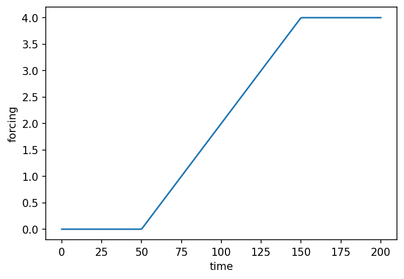

# utils.forcing.create_piecewise_forcing { #climatecritters.utils.forcing.create_piecewise_forcing }

```python
utils.forcing.create_piecewise_forcing(elements, label='forcing')
```

Build a piecewise forcing from a sequence of :class:`~climatecritters.core.ForcingElement` parts.

Compiles the sequence immediately and returns a callable
:class:`~climatecritters.core.Forcing`.

## Parameters {.doc-section .doc-section-parameters}

<code>[**elements**]{.parameter-name} [:]{.parameter-annotation-sep} [sequence of ForcingElement]{.parameter-annotation}</code>

:   Ordered :class:`~climatecritters.core.Hold`, :class:`~climatecritters.core.Ramp`, :class:`~climatecritters.core.Harmonic`, or general :class:`~climatecritters.core.ForcingElement` instances.

<code>[**label**]{.parameter-name} [:]{.parameter-annotation-sep} [[str](`str`)]{.parameter-annotation} [ = ]{.parameter-default-sep} [\'forcing\']{.parameter-default}</code>

:   Human-readable label.  Default ``'forcing'``.

## Returns {.doc-section .doc-section-returns}

<code>[**forcing**]{.parameter-name} [:]{.parameter-annotation-sep} [[Forcing](`climatecritters.core.forcing.Forcing`)]{.parameter-annotation}</code>

:   

## Examples {.doc-section .doc-section-examples}

```python
import matplotlib.pyplot as plt
import climatecritters as cc
from climatecritters.utils.forcing import create_piecewise_forcing

f = create_piecewise_forcing([
    cc.forcing.Hold(duration=50,  value=0.0),
    cc.forcing.Ramp(duration=100, y0=0.0, yf=4.0),
    cc.forcing.Hold(duration=50,  value=4.0),
], label="CO2 ramp")
fig, ax = f.plot()
ax.set_xlabel('time'); ax.set_ylabel('forcing')
plt.savefig('docs/reference/figures/create_piecewise_forcing_example.png',
            dpi=150, bbox_inches='tight')
```


