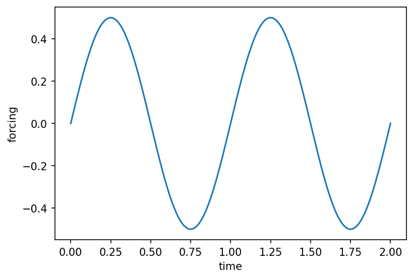

# utils.forcing.create_sinusoid_forcing { #climatecritters.utils.forcing.create_sinusoid_forcing }

```python
utils.forcing.create_sinusoid_forcing(A, period, y0=0.0, duration=None)
```

Build a sinusoidal forcing: ``f(t) = y0 + A * sin(2π t / period)``.

## Parameters {.doc-section .doc-section-parameters}

<code>[**A**]{.parameter-name} [:]{.parameter-annotation-sep} [[float](`float`)]{.parameter-annotation}</code>

:   Amplitude.

<code>[**period**]{.parameter-name} [:]{.parameter-annotation-sep} [[float](`float`)]{.parameter-annotation}</code>

:   Period (same time units as the model).  Must be > 0.

<code>[**y0**]{.parameter-name} [:]{.parameter-annotation-sep} [[float](`float`)]{.parameter-annotation} [ = ]{.parameter-default-sep} [0.0]{.parameter-default}</code>

:   Constant offset.  Default 0.0.

<code>[**duration**]{.parameter-name} [:]{.parameter-annotation-sep} [[float](`float`)]{.parameter-annotation} [ = ]{.parameter-default-sep} [None]{.parameter-default}</code>

:   If given, returns a :class:`~climatecritters.core.ForcingElement`. If omitted, returns an indefinite :class:`~climatecritters.core.Forcing`.

## Returns {.doc-section .doc-section-returns}

<code>[]{.parameter-name} [:]{.parameter-annotation-sep} [[Forcing](`climatecritters.core.forcing.Forcing`) or [ForcingElement](`climatecritters.core.forcing.ForcingElement`)]{.parameter-annotation}</code>

:   

## Raises {.doc-section .doc-section-raises}

<code>[:]{.parameter-annotation-sep} [[ValueError](`ValueError`)]{.parameter-annotation}</code>

:   If ``period`` ≤ 0.

## Examples {.doc-section .doc-section-examples}

```python
import matplotlib.pyplot as plt
from climatecritters.utils.forcing import create_sinusoid_forcing

f = create_sinusoid_forcing(A=0.5, period=1.0)
fig, ax = f.plot(t_span=(0, 2))
plt.savefig('docs/reference/figures/create_sinusoid_forcing_example.png',
            dpi=150, bbox_inches='tight')
```


