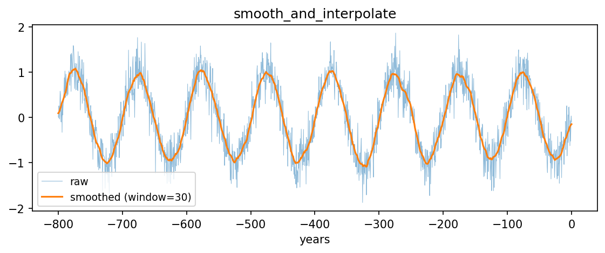

# utils.func.smooth_and_interpolate { #climatecritters.utils.func.smooth_and_interpolate }

```python
utils.func.smooth_and_interpolate(years, values, target_years=None, window=50)
```

Apply a centered moving-average and interpolate onto a target time axis.

## Parameters {.doc-section .doc-section-parameters}

<code>[**years**]{.parameter-name} [:]{.parameter-annotation-sep} [[array](`array`) - [like](`like`)]{.parameter-annotation}</code>

:   Input time axis.

<code>[**values**]{.parameter-name} [:]{.parameter-annotation-sep} [[array](`array`) - [like](`like`)]{.parameter-annotation}</code>

:   Values to smooth and interpolate.

<code>[**target_years**]{.parameter-name} [:]{.parameter-annotation-sep} [[array](`array`) - [like](`like`) or None]{.parameter-annotation} [ = ]{.parameter-default-sep} [None]{.parameter-default}</code>

:   Target time axis for interpolation.  Defaults to integer annual spacing spanning the input range.

<code>[**window**]{.parameter-name} [:]{.parameter-annotation-sep} [[int](`int`)]{.parameter-annotation} [ = ]{.parameter-default-sep} [50]{.parameter-default}</code>

:   Moving-average window length.  Values ≤ 1 disable smoothing. Default 50.

## Returns {.doc-section .doc-section-returns}

<code>[**smoothed_interp**]{.parameter-name} [:]{.parameter-annotation-sep} [[ndarray](`ndarray`)]{.parameter-annotation}</code>

:   Values smoothed and interpolated onto ``target_years``.

## Examples {.doc-section .doc-section-examples}

```python
import numpy as np
import matplotlib.pyplot as plt
from climatecritters.utils.func import smooth_and_interpolate

years = np.linspace(-800, 0, 1600)
values = np.sin(2 * np.pi * years / 100) + 0.3 * np.random.default_rng(0).standard_normal(1600)
smoothed = smooth_and_interpolate(years, values, window=30)
target = np.arange(-800, 1, 1.0)
fig, ax = plt.subplots(figsize=(9, 3))
ax.plot(years, values, lw=0.5, alpha=0.5, label='raw')
ax.plot(target, smoothed, lw=1.5, label='smoothed (window=30)')
ax.set_xlabel('years'); ax.legend(fontsize=9)
ax.set_title('smooth_and_interpolate')
plt.savefig('docs/reference/figures/smooth_and_interpolate_example.png',
            dpi=150, bbox_inches='tight')
```


