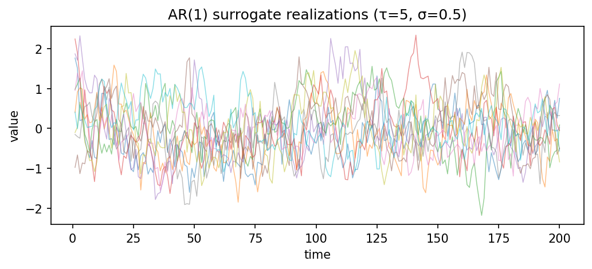

# utils.noise.from_param { #climatecritters.utils.noise.from_param }

```python
utils.noise.from_param(
    method='uar1',
    noise_param=None,
    length=50,
    number=1,
    time_pattern='even',
    settings=None,
    seed=None,
    label=None,
)
```

Generate surrogate series from a parametric noise model.

## Parameters {.doc-section .doc-section-parameters}

<code>[**method**]{.parameter-name} [:]{.parameter-annotation-sep} [[str](`str`)]{.parameter-annotation} [ = ]{.parameter-default-sep} [\'uar1\']{.parameter-default}</code>

:   Noise model.  Supported values: ``'ar1sim'``, ``'uar1'``, ``'CN'`` (colored noise).  Default ``'uar1'``.

<code>[**noise_param**]{.parameter-name} [:]{.parameter-annotation-sep} [[list](`list`) or None]{.parameter-annotation} [ = ]{.parameter-default-sep} [None]{.parameter-default}</code>

:   Model parameters:  - ``'ar1sim'`` / ``'uar1'``: ``[tau, sigma0]`` - ``'CN'``: ``[beta]``  Default ``[1, 1]``.

<code>[**length**]{.parameter-name} [:]{.parameter-annotation-sep} [[int](`int`)]{.parameter-annotation} [ = ]{.parameter-default-sep} [50]{.parameter-default}</code>

:   Length of each surrogate series.  Default 50.

<code>[**number**]{.parameter-name} [:]{.parameter-annotation-sep} [[int](`int`)]{.parameter-annotation} [ = ]{.parameter-default-sep} [1]{.parameter-default}</code>

:   Number of surrogate realizations to generate.  Default 1.

<code>[**time_pattern**]{.parameter-name} [:]{.parameter-annotation-sep} [[str](`str`)]{.parameter-annotation} [ = ]{.parameter-default-sep} [\'even\']{.parameter-default}</code>

:   Time-axis generation pattern.  One of:  - ``'even'`` — evenly spaced with spacing ``delta_t`` from   ``settings`` (default 1.0) - ``'random'`` — random spacing via ``delta_t_dist`` and ``param``   in ``settings`` - ``'specified'`` — explicit ``time`` array passed in ``settings``

<code>[**settings**]{.parameter-name} [:]{.parameter-annotation-sep} [[dict](`dict`) or None]{.parameter-annotation} [ = ]{.parameter-default-sep} [None]{.parameter-default}</code>

:   Additional options forwarded to the surrogate generator. Default ``None``.

<code>[**seed**]{.parameter-name} [:]{.parameter-annotation-sep} [[int](`int`) or None]{.parameter-annotation} [ = ]{.parameter-default-sep} [None]{.parameter-default}</code>

:   Random seed for reproducibility.  Default ``None``.

<code>[**label**]{.parameter-name} [:]{.parameter-annotation-sep} [[str](`str`) or None]{.parameter-annotation} [ = ]{.parameter-default-sep} [None]{.parameter-default}</code>

:   Label attached to the returned ``SurrogateSeries``.  Default ``None``.

## Returns {.doc-section .doc-section-returns}

<code>[**surr**]{.parameter-name} [:]{.parameter-annotation-sep} [[pyleoclim](`pyleoclim`).[SurrogateSeries](`pyleoclim.SurrogateSeries`)]{.parameter-annotation}</code>

:   Surrogate series object; ``surr.series_list`` contains ``number`` series.

## See also {.doc-section .doc-section-see-also}

pyleoclim.SurrogateSeries : Underlying surrogate generator.

## Examples {.doc-section .doc-section-examples}

```python
import matplotlib.pyplot as plt
from climatecritters.utils.noise import from_param

# Ten AR(1) realizations with tau=5, sigma=0.5
surr = from_param(method='ar1sim', noise_param=[5, 0.5],
                  length=200, number=10, seed=0)
fig, ax = plt.subplots(figsize=(8, 3))
for s in surr.series_list:
    ax.plot(s.time, s.value, lw=0.7, alpha=0.5)
ax.set_xlabel('time'); ax.set_ylabel('value')
ax.set_title('AR(1) surrogate realizations (τ=5, σ=0.5)')
plt.savefig('docs/reference/figures/from_param_example.png',
            dpi=150, bbox_inches='tight')
```


