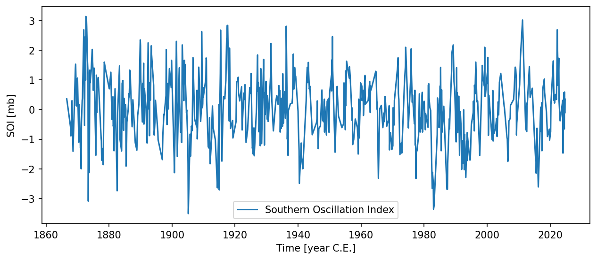

# utils.resample.downsample { #climatecritters.utils.resample.downsample }

```python
utils.resample.downsample(
    series,
    method='exponential',
    param=None,
    return_index=False,
    seed=None,
)
```

Downsample a Pyleoclim series by drawing random time increments.

Simulates irregular sampling by generating random index increments from a
chosen probability distribution and selecting the corresponding time points
from the original series.

## Parameters {.doc-section .doc-section-parameters}

<code>[**series**]{.parameter-name} [:]{.parameter-annotation-sep} [[pyleoclim](`pyleoclim`).[Series](`pyleoclim.Series`)]{.parameter-annotation}</code>

:   The time series to downsample.

<code>[**method**]{.parameter-name} [:]{.parameter-annotation-sep} [[str](`str`)]{.parameter-annotation} [ = ]{.parameter-default-sep} [\'exponential\']{.parameter-default}</code>

:   Probability distribution used to draw index increments.  One of:  - ``'exponential'`` — exponential distribution; ``param`` is a   1-element list ``[scale]`` (i.e. mean gap size). - ``'poisson'`` — Poisson distribution; ``param`` is ``[rate]``. - ``'pareto'`` — Pareto distribution; ``param`` is   ``[shape, scale]``. - ``'random_choice'`` — discrete distribution; ``param`` is   ``[values, probabilities]`` where both arrays have the same length.  Default ``'exponential'``.

<code>[**param**]{.parameter-name} [:]{.parameter-annotation-sep} [[list](`list`) or None]{.parameter-annotation} [ = ]{.parameter-default-sep} [None]{.parameter-default}</code>

:   Parameter(s) for the chosen distribution.  Default ``[1]`` (exponential with scale 1).

<code>[**return_index**]{.parameter-name} [:]{.parameter-annotation-sep} [[bool](`bool`)]{.parameter-annotation} [ = ]{.parameter-default-sep} [False]{.parameter-default}</code>

:   If ``True``, return the integer index array instead of a new series. Default ``False``.

<code>[**seed**]{.parameter-name} [:]{.parameter-annotation-sep} [[int](`int`) or None]{.parameter-annotation} [ = ]{.parameter-default-sep} [None]{.parameter-default}</code>

:   Seed for the random number generator.  Pass an integer for reproducible results.  Default ``None``.

## Returns {.doc-section .doc-section-returns}

<code>[**downsampled**]{.parameter-name} [:]{.parameter-annotation-sep} [pyleoclim.Series or list of int]{.parameter-annotation}</code>

:   Downsampled series (``return_index=False``) or list of selected indices (``return_index=True``).

## Raises {.doc-section .doc-section-raises}

<code>[:]{.parameter-annotation-sep} [[ValueError](`ValueError`)]{.parameter-annotation}</code>

:   If ``method`` is not recognised, or ``param`` has the wrong shape for the chosen distribution.

## Examples {.doc-section .doc-section-examples}

```python
import matplotlib.pyplot as plt
import pyleoclim as pyleo
from climatecritters.utils.resample import downsample

soi = pyleo.utils.load_dataset('SOI')
soi_sparse = downsample(soi, method='exponential', param=[3.0], seed=42)
soi_sparse.plot()
plt.savefig('docs/reference/figures/downsample_example.png',
            dpi=150, bbox_inches='tight')
```


