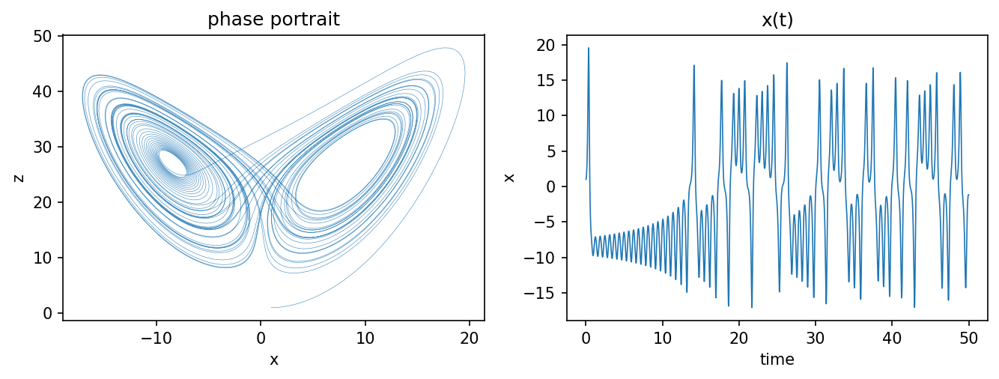
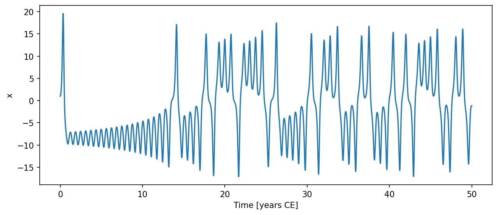
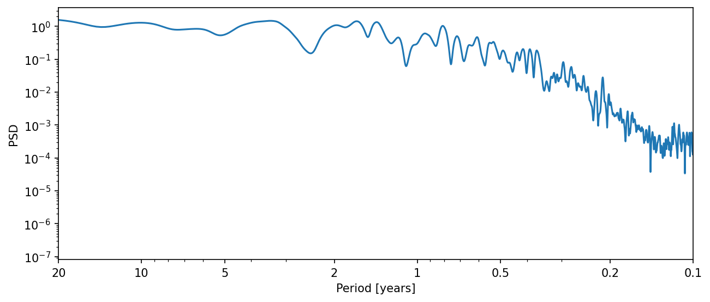
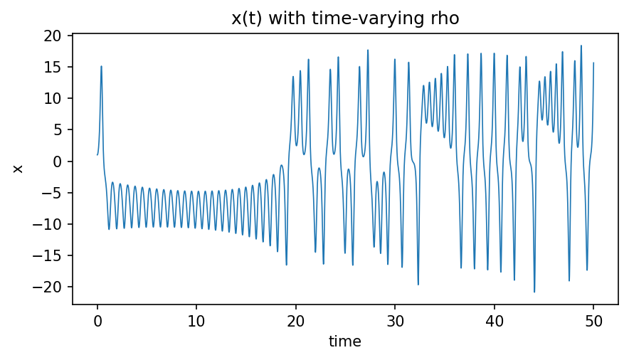

This page walks through a complete end-to-end example in about 15 lines of code. We'll build a Lorenz 63 system, integrate it, and export the result to Pyleoclim for a quick spectral analysis.

## 1. Create a model

Any model parameter or state variable can be driven by an external `Forcing`. For the Lorenz 63 system we register a (zero, for now) forcing on the x-equation via `register_forcing`.

```python
import climatecritters as cc
from climatecritters.model_critters import Lorenz63

model = Lorenz63(sigma=10.0, rho=28.0, beta=8/3)
forcing = cc.Forcing(lambda t: 0.0)
model.register_forcing('x', forcing, attachment_style='additive', timing='pre')
```

## 2. Integrate

Call `integrate()` with an integration window, initial conditions, and a solver method. It returns an `Output` object containing the full trajectory.

```python
output = model.integrate(
    t_span=(0, 50),
    y0=[1.0, 1.0, 1.0],
    method='RK45',
)
```

A quick look at the raw trajectory:

```python
import matplotlib.pyplot as plt

fig, axes = plt.subplots(1, 2, figsize=(9, 3.5))
axes[0].plot(output.state_variables['x'], output.state_variables['z'], lw=0.3, alpha=0.8)
axes[0].set_xlabel('x'); axes[0].set_ylabel('z'); axes[0].set_title('phase portrait')
axes[1].plot(output.time, output.state_variables['x'], lw=0.8)
axes[1].set_xlabel('time'); axes[1].set_ylabel('x'); axes[1].set_title('x(t)')
fig.tight_layout()
plt.savefig('figures/quickstart_integrate.png', dpi=150, bbox_inches='tight')
```



## 3. Inspect the output

```python
print(output.state_variables.dtype.names)   # ('x', 'y', 'z')
print(output.time[:5])                       # first five time points
```

## 4. Export to Pyleoclim

`to_pyleo()` converts any state variable into a Pyleoclim `Series` (or `MultipleSeries` for a list of names), enabling the full suite of Pyleoclim analysis and plotting tools.

```python
ts_x = output.to_pyleo(var_names='x')
ts_x.plot(savefig_settings={'path': 'figures/quickstart_pyleo_plot.png', 'dpi': 150})
```



For a quick spectral analysis:

```python
psd = ts_x.spectral()
psd.plot(savefig_settings={'path': 'figures/quickstart_pyleo_spectral.png', 'dpi': 150})
```



## 5. Try a time-varying parameter

Any parameter can be replaced with a callable at construction time. The callable must have signature `(t)`, `(t, state)`, or `(t, state, model)`.

```python
# rho increases linearly from 20 to 40 over the integration window
model_tv = Lorenz63(
    sigma=10.0,
    rho=lambda t: 20.0 + (20.0 / 50.0) * t,
    beta=8/3,
)
model_tv.register_forcing('x', forcing, attachment_style='additive', timing='pre')
output_tv = model_tv.integrate(t_span=(0, 50), y0=[1, 1, 1], method='RK45')
```

```python
fig, ax = plt.subplots(figsize=(6, 3.5))
ax.plot(output_tv.time, output_tv.state_variables['x'], lw=0.8)
ax.set_xlabel('time'); ax.set_ylabel('x'); ax.set_title('x(t) with time-varying rho')
fig.tight_layout()
plt.savefig('figures/quickstart_time_varying.png', dpi=150, bbox_inches='tight')
```



## Next steps

- [Core concepts](concepts.qmd) — understand `Model`, `Forcing`, and `Output` in depth
- [Tutorials](../tutorials/index.qmd) — worked examples for climate and dynamical systems models
- [Reference](../api/index.qmd) — full API documentation
